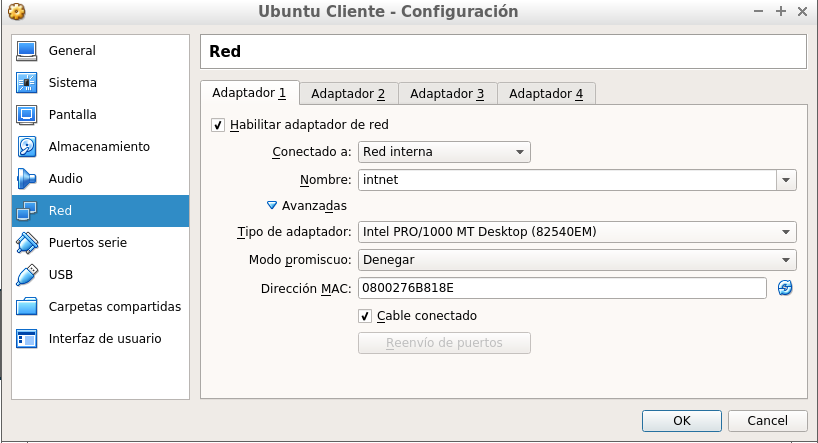
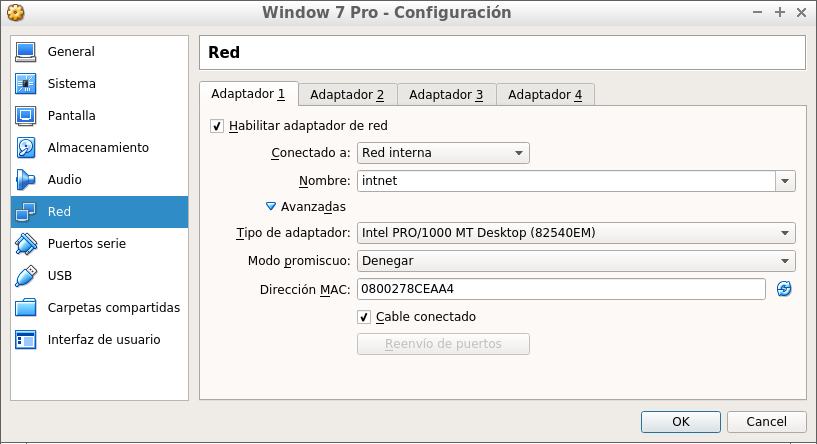
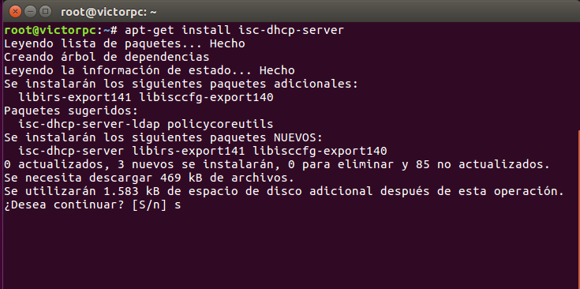
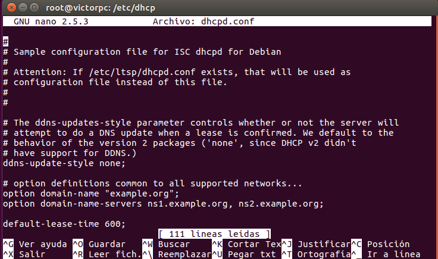
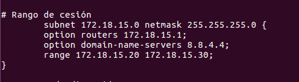
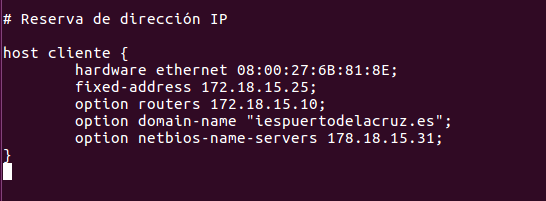
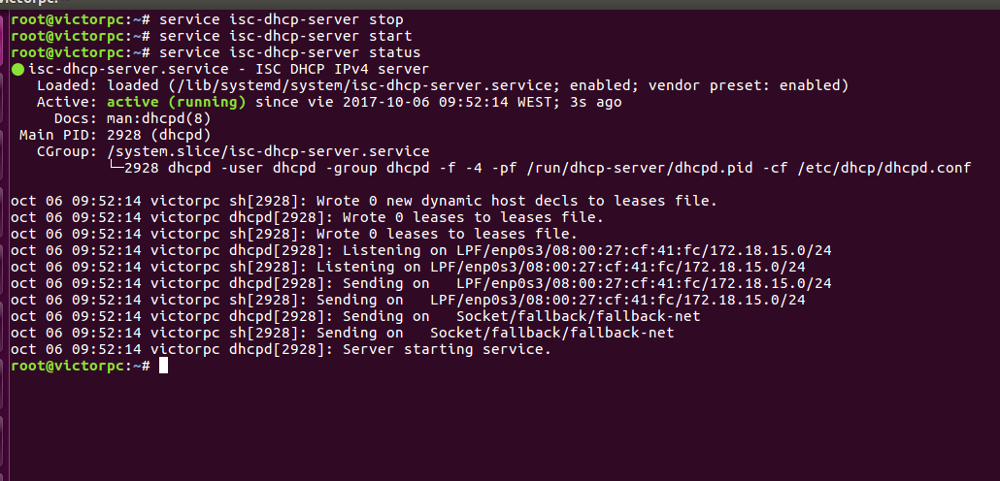
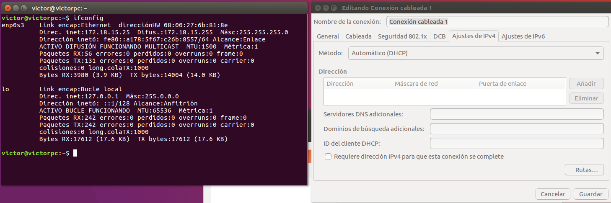

#  Instalación y Configuración DHCP Linux

# 1. Introducción.

* Configuración de las máquinas virtuales en red interna.
* Configuración de un servidor DHCP en Ubuntu.
* Comprobar conexión desde los Clientes Ubuntu y Window.
---

# 2. Configuración de VirtualBox

### 2.1 Máquinas Ubuntu

Configuración

### 2.2 Máquina Window

Configuración

# 3. Instalación y configuración del servicio DHCP en Ubuntu Server.

### 3.1 Instalación

Abrimos una consola como root y utilizamos el comando `apt-get install isc-dhcp-server`
para instalar el servicio. ( tenemos que poner la configuración de red en *adaptador puente* en este paso para poder instalar el servicio.)

### 3.2 Configuración

Ahora vamos al archivo de configuración **dhcpd.conf** en la siguiente ruta.

 

Abrimos el archivo de configuración con **nano** para configurar el servicio DHCP.

 

Ahora vamos a configurar un rango de cesión con su puerta de enlace y su dominio. Esto lo hacemos para que las Ips que asigne por dhcp, estén dentro del rango que queramos.

 

También podemos hacer una reserva para ciertos clientes, en este caso, voy a crear una reserva para el cliente ubuntu. Para esto, necesito poner su mac y la IP, dominio y puerta de enlace que le quiero asignar.

Terminada la configuración anterior, guardamos el archivo y iniciamos el servicio dhcp con los siguiente comando: `service isc-dhcp-server stop` y `service isc-dhcp-server start`

# 4. Comprobaciones en los clientes

### 4.1 Comprobación en el cliente ubuntu

Comprobamos que nos asigna la IP dentro del rango y reservada ya que la MAC de este cliente es la que usé en la reserva.

### 4.2 Comprobación en el cliente Window

En este cliente no le puse reserva, por lo que la IP que nos asigna, es la primera disponible dentro del rango.

**Podemos comprobar que el servidor da IP por DHCP tanto al cliente ubuntu como window.**
