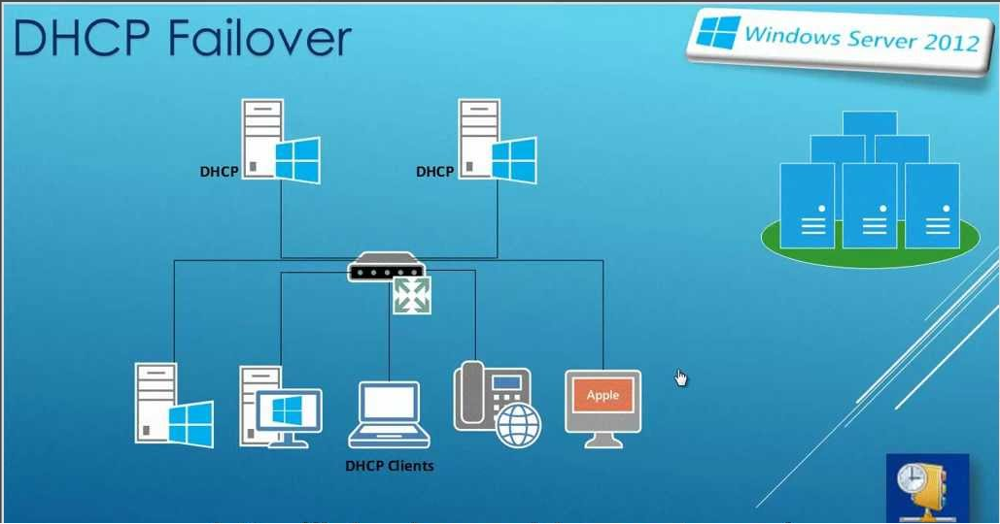
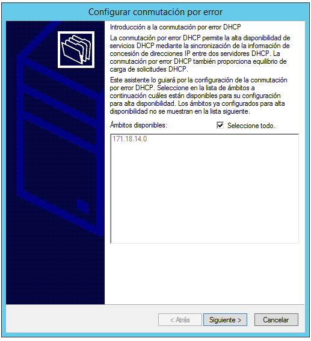
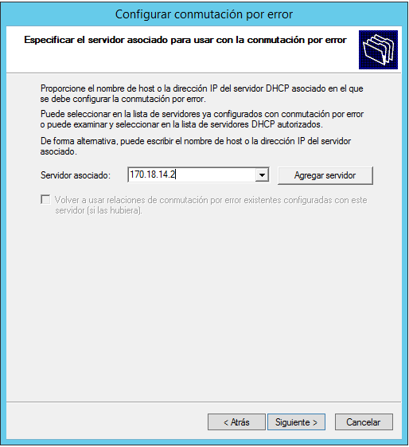
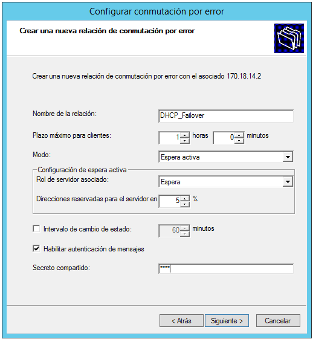
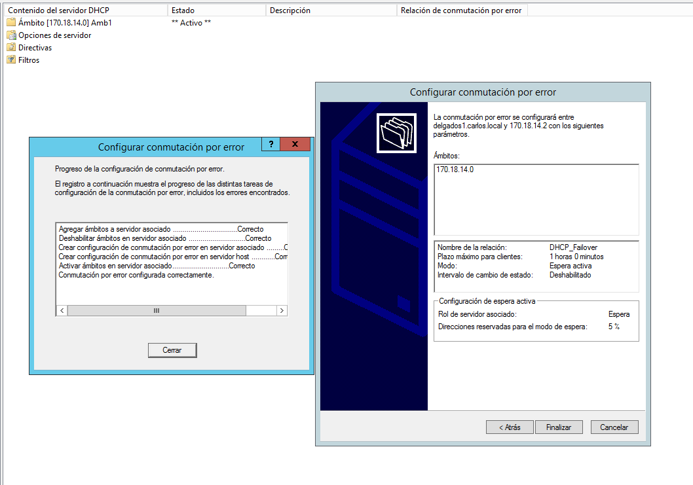
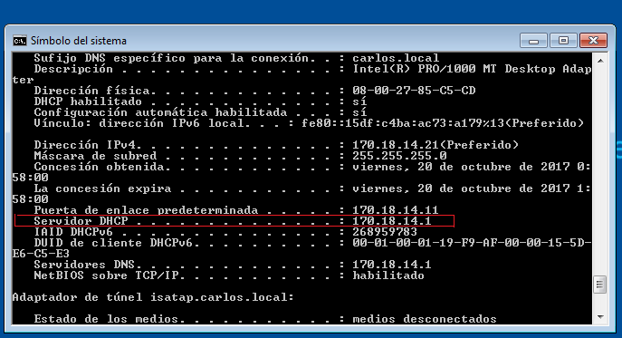
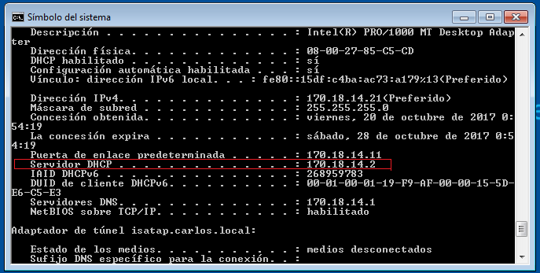


>Práctica Realizada por:
>
>[Carlos]
>
>[Carmelo González Domínguez]
>
>[Víctor García Luis]

# DHCP Failover Windows Server 2012

### Objetivo:

+ Vamos a configurar un nuevo servidor que nos va a permitir establecer un servicio DHCP Failover. Esto es una nueva característica que permite que los dos servidores DHCP compartan información de servicio entre sí, para proporcionar una alta disponibilidad DHCP.
Conmutación por error DHCP funciona mediante la replicación de concesiones de direcciones IP y la configuración de uno o más ámbitos DHCP de un servidor DHCP principal a un servidor asociado de conmutación por error.

- [1. Configuración del servidor principal](#1)

- [2. Configuración del DHCP Failover](#2)

- [3. Comprobaciones desde el cliente](#3)

# 1.                  

# 2. DHCP Failover

Pulsamos el botón secundario del ratón en el dominio del servidor principal que ya tenemos creado de las prácticas anteriores y seleccionamos `configurar conmutación por error.`

Se nos abre la siguiente ventana para seleccionar los ámbitos disponibles que queramos. En nuestro caso solo tenemos uno.

Introducimos la IP del servidor asociado para pasar toda la información del ámbito del servidor principal.

Creamos la relación de conmutación por error. Nosotros lo vamos a configurar en `Espera activa` esto significa que el servidor asociado asume un rol en espera, con responsabilidad para emitir concesiones a clientes DHCP sólo si el servidor activo no está disponible.

Finalizamos la instalación y vemos como el registro nos indica que el proceso de las distintas tareas se han configurado correctamente.

---

# 3. Comprobaciones

Vamos a comprobar que el Failover funciona correctamente. Primero hacemos la prueba en el cliente con el servidor DHCP principal en funcionamiento:

+ Como podemos comprobar, nos da la IP por DHCP el servidor principal.

Ahora apagamos el servidor principal y hacemos en el cliente un `ipconfig /release` para liberar la dirección IP y un `ipconfig /renew` para renovar la dirección IP.

+ Como podemos comprobar, ahora nos da la IP desde el Servidor asociado.

---
