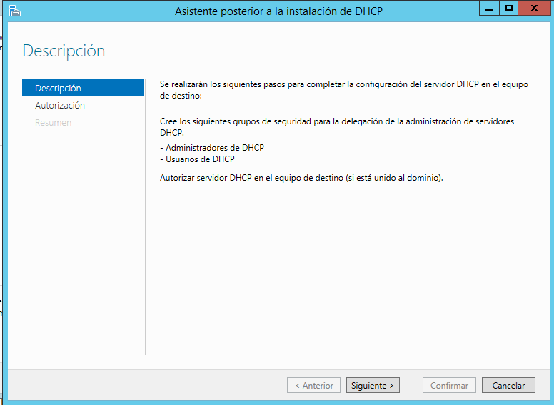
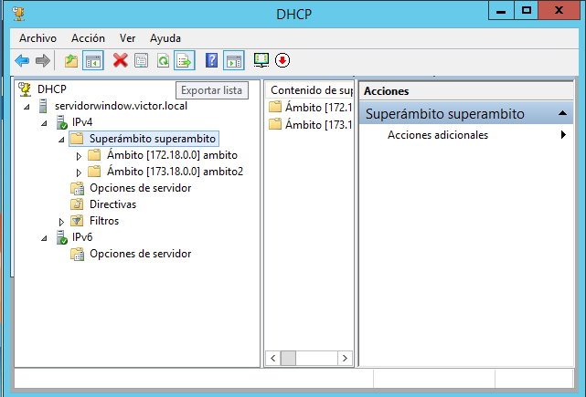

# Instalación y Configuración DHCP Windows

#### Práctica de instalación y configuración del DHCP en window server, se harán ámbitos, exclusiones, reservas de IP, superámbitos etc...

---

# 1. Instalación del DHCP en Window Server 2012

Dentro del Administrador del servidor, vamos a *Agregar roles y características.*

Vamos a roles del servidor y marcamos la casilla *Servidor DHCP*

Agregamos la características

Seguimos con la instalación estándard

Una vez llegado a resultados, cuando termine, nos aparecerá una pestaá llamada `Completar configuración DHCP` la pinchamos y vamos a autorización.

Ponemos el nombre del equipo para las credenciales.

Luego le damos a confirmar y cerramos la ventana.

# 1.1 Configuración DHCP

Ahora tenemos que ir a la pestaña Herramientas/DHCP.

Dentro de DHCP, iremos al dominio, IPV4 click derecho y pulsaremos en `Nuevo Ámbito`

Le ponemos un nombre al ámbito, le damos a siguiente y comenzamos por poner el intervalo de direcciones que queremos que estén dentro de este ámbito.

Le damos a siguiente y ahora vamos a excluir alguna IP que no queremos que excluya el ámbito, ( debe estar dentro del intervalo anterior)

seguimos la configuración estandad

Ahora tenemos que poner la ip del router ( puerta de enlace )

Nombre de dominio y DNS predeterminado de la configuración del servidor.

Activamos el ámbitos.

Ya podemos comprobar que tenemos el ámbito activado.

# 2 Comprobación del ámbito desde el cliente

+ Si la instalación ha ido bien, vamos al cliente **(Tenemos tanto el cliente como el servidor configurado en la misma red internamente)** y comprobamos que nos da IP por DHCP y que esta, está dentro del rango asignado en el ámbito.

Comprobación funcionando.

Comprobación desde el servidor

# 2.1 Creación de un segundo ámbito

+ Ahora vamos a crear un segundo ámbito con otra IP para más adelante, hacer reservas y un superámbito. Tenemos que seguir los mismos pasos anteriores pero con una IP o una máscara diferente ya que si es igual, detectará que ya está usada en el priemr ámbito.

Segundo ámbito

Volvemos hacer la exclusión de la IP o IPs que queramos

Ya tenemos los dos ámbitos creados.

+ **Como solo estamos probando con un cliente, hasta que el primer ámbito no se llene, tendremos que desactivar el primer ámbito para probar el segundo, este funcionará exactamente igual que el primero poniendo otra tarjeta de red, ya que solo disponemos de un router y las ips son diferentes. El resultado es exactamente el mismo pero con la IP 173.**

# 3. Creación de un Superámbito

+ Ahora vamos a crear un superámbito para unir los dos ámbitos creados anteriormente.

Le damos botón derecho en IPv4 y pulsamos en nuevo superámbito. Le ponemos el nombre que queramos.

Marcamos los dos ámbitos disponibles y le damos a siguiente.

Nos saldrá los dos ámbitos que vamos añadir al superámbito, le damos a finalizar.

Podemos comprobar que se ha creado correctamente. ( si desactivamos el superámbito, se desactivan lkos dos ámbitos)

Ahora vamos hacer una reserva dentro de los rangos puesto en cualquiera de los dos ámbitos, añadimos la IP que queremos utilizar y la MAC del cliente. Si la IP no está utilizada, el ámbito agregará automáticamente esa IP al cliente.

Como podemos comprobar, con el superámbito creado y los dos ámbitos activos, funciona correctamente.

