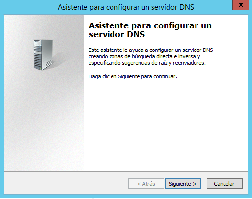
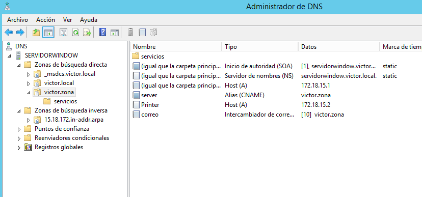
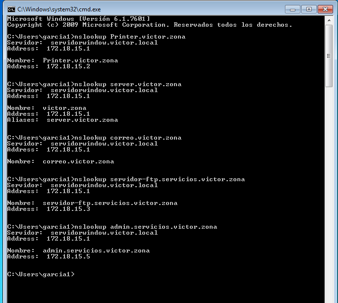

# Instalación y configuración de un servidor DNS

---
- [Configuración del servidor DNS](#1)
- [Registros a la zona de Búsqueda directa](2)
- [Configuración y comprobación desde el cliente](3)

### Objetivo:

+ Vamos a configurar un servidor DNS en Window 2012 Server con una zona de búsqueda directa para el servidor y una zona inversa para la subred. Tendremos que tener acceso a internet desde el cliente teniendo en este, la IP del  servidor como DNS.

# 1. Configuración del Servidor DNS 

+ Le ponemos una IP Fija al servidor y como DNS nuestra propia IP.

+ Vamos a la adminitración del servidor, herramientas y administrador DNS. Le damos botón derecho en nuestro servidor y `Configurar un servidor DNS`

+ Seguimos el asistente para configurar el servidor.

+ Creamos la zona de búsqueda directa e inversa.

+ Ahora nos pedirá crear la zona de búsqueda directa para configurarla.

+ El tipo de zona será la principal para que cree una zona que se actualice directamente desde este servidor.

+ Seleccionamos como queremos que se repliquen los datos DNS por la red. Seleccionamos para todo los servidores DNS que se ejecuten en el controlador de dominio creado en prácticas anteriores.

+ Le ponemos un nombre a la zona ( el que queramos )

+ A continuación tendremos que crear y configurar la zona de búsqueda inversa.

+ Creamos de nuevo un tipo de zona Principal.

+ Para todos los servidores DNS que se ejecuten en nuestro controlador de dominio.

+ Como estamos usando IPv4, seleccionamos una zona de búsqueda inversa para IPv4.

+ Escribimos el id de red o el nombre de zona.

+ Permitimos actualizaciones dinbámicas seguras.

+ Añadimos la IP de un servidor DNS público para que nuestro servidor reenvie las consultas.

+ Finalizamos la instalación.

+ Comprobamos que se ha creado correctamente los reenviadores.

+ Como podemos ver, ya tenemos nuestras zonas instaladas y configuradas.

+ Comprobamos que tenemos acceso a internet, teniendo como DNS nuestra misma IP.

# 2. Añadir registros a la zona de búsqueda directa

+ Añadimos un registro de dirección de host para asignar un nombre de dominio DNS a una dirección IP.

+ Le ponemos la IP del servidor.

+ Añadimos un alias al nombre de dominio.

+ Yo lo voy a llamar server pero le ponemos poder el que queramos.

+ Añadimos un host llamado Printer y le ponemos una IP.

+ Añadimos un servidor de correo.

+ Le ponemos el nombre.

+ Dentro de la zona directa, creamos una subzona llamada servicios.

+ Agregamos a la subzona un servidor ftp y le ponemos una IP.

+ Creamos el equipo de administrador del sistema con su IP.

### 2.1 Comprobación desde el servidor.

+ Realizamos varios `nslookup` con los nombres de los registros creados anteriormente.

# 3. Cliente

+ Le ponemos una IP fija al cliente para tenerlo identificado más facilmente desde el servidor. Le añadimos la IP del servidor como DNS.

+ Comprobamos que tenemos acceso a internet

+ Comprobamos que se ha añadido un nuevo registro en el servidor desde que hemos conectado con el cliente. Efectivamente, podemos ver `Victor-Pc con su IP` en el servidor.

+ Hacemos `nslookup` a los registros creados en el servidor y vemos que nos da tanto la dirección y nombre del servidor, como la dirección y nombre del propio registro.

---
