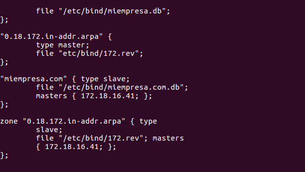
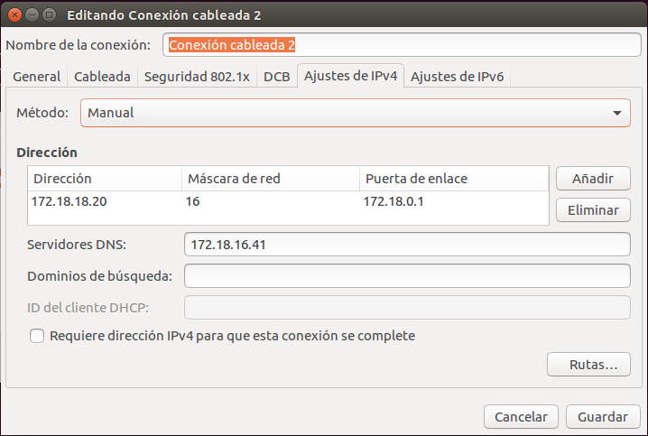

>Práctica Realizada por:
>
>[Yared ]()
>
>[Carmelo González Domínguez](https://github.com/SilverGG)
>
>[Víctor García Luis](https://github.com/victorvgl)

# DNS-UBUNTU.

## 1. Servidor.
### 1.1 Instalación y configuración.
Comenzamos instalando el servidor *DNS* de *bind9*.  
  

Nos dirigimos al fichero `/etc/resolv.conf` u asignamos la `IP 127.0.0.1` para redirigir el *DNS* a nuestra máquina.  
  

Luego, vamos a `/etc/bind/named.conf.options` y añadimos los reenviadores.  
  

Reiniciamos el servicio y comprobamos su funcionamiento tanto en el servidor como en el cliente.  
  

  

Ahora, creamos la zona directa e inversa en `/etc/bind/named.conf.local` de la siguiente manera.  
  

Configuramos la zona directa agregando a los posibles clientes.  
  

Configuramos la zona inversa agregando a los posibles clientes, en este caso, *isr-carmelo2.miempresa.com* y *imw.miempresa.com*.  
  

Aquí indica al servidor Linux que el DNS lo otorga él mismo

## 2. Creación del servidor esclavo.  
### 2.1 Confiuración.

Clonamos la máquina servidor para que haga de esclavo.  

Empezamos indicando en el miempresa.db del esclavo, quien es el servidor maestro.  

Y terminamos añadiendo el `also-notify` en el maestro para mantener los dns sincronizados.  

## 3. Cliente.
### 3.1 Master.
Una vez en el cliente, asignamos el nuevo servidor *DNS* y comprobamos si funciona.  
  

Éxito.  

### 3.2 Slave.  
Habiendo apagado la máquina, volvemos a comprobar si el *DNS* maestro está siendo respaldado.  

Éxito.   
 
