
>Práctica Realizada por:
>
>[Carlos Delgado Hernández](https://github.com/carlsjdh)
>
>[Carmelo González Domínguez](https://github.com/SilverGG)
>
>[Víctor García Luis](https://github.com/victorvgl)

# Panel de control webmin

---

### [Instalación de Webmin](#1)

+ Instalaremos en nuestro servidor Ubuntu `Webmin`, una herramienta de configuración de sistemas accesible vía web para sistemas Unix, como GNU/Linux y OpenSolaris, GNU/Linux. Con él se pueden configurar aspectos internos de muchos sistemas operativos, como usuarios, cuotas de espacio, servicios, archivos de configuración, apagado del equipo, etc, así como modificar y controlar muchas aplicaciones libres, como el servidor web Apache, PHP, MySQL, DNS, Samba, DHCP, entre otros.

  Por defecto **se comunica mediante TCP a través del puerto 10000**, y puede ser configurado para usar SSL si OpenSSL está instalado con módulos de Perl adicionales requeridos.

  Webmin también permite controlar varias máquinas a través de una interfaz simple, o iniciar sesión en otros servidores webmin de la misma subred o red de área local.

### [Configuración y uso de Webmin](#2)

+ Configuraremos la herramienta y mostraremos los múltiples usos y posibilidades para gestionar, modificar y controlar las aplicaciones instaladas en prácticas anteriores como PHP, MySQL, DNS etc...

#  1. Descarga e instalación de Webmin en Ubuntu

+ Nos descargamos el instalador del siguiente [Enlace](http://www.webmin.com/download.html)

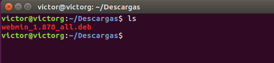

+ Una vez descargado, realizamos la instalación.

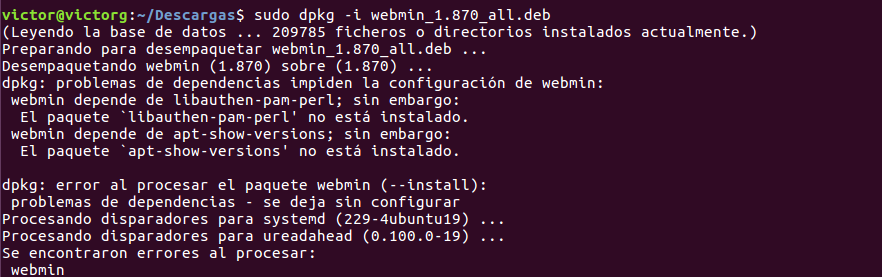

+ Nos aparecerán una serie de errores que solucionaremos de la siguiente manera:
`apt-get -f install -y`

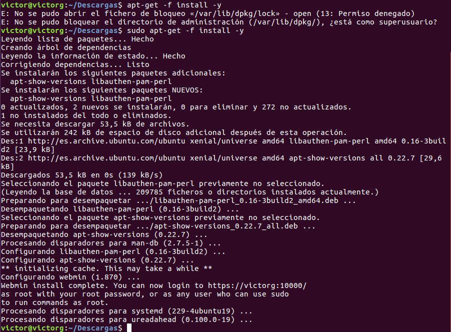

+ Una vez instalado, comprobaremos que podemos acceder al panel desde el navegador. Por defecto Webmin se conecta por TCP a través del puerto 10000 por lo que pondremos la IP de nuestro servidor junto con el puerto.

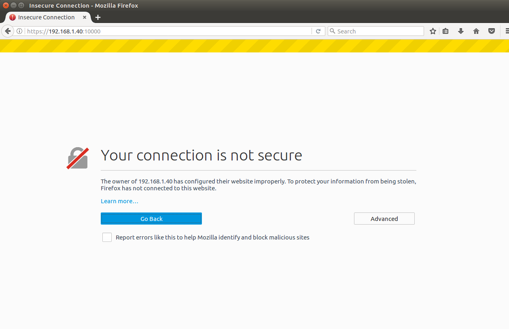

+ Aceptamos la conexión no segura ya que webmin accede por defecto mediante https y nos logueamos con nuestro usuario y contraseña de la sesión en la que nos encontremos.

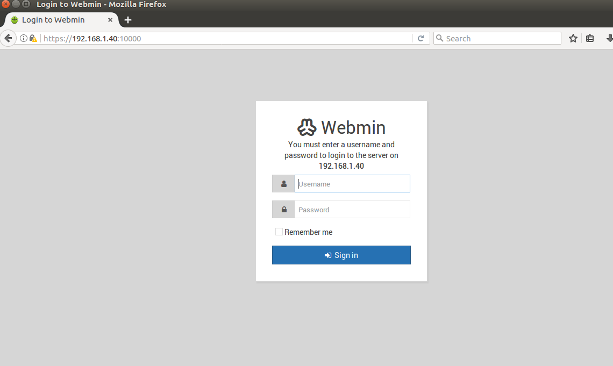

+ Como podemos comprobar, podemos acceder correctamente

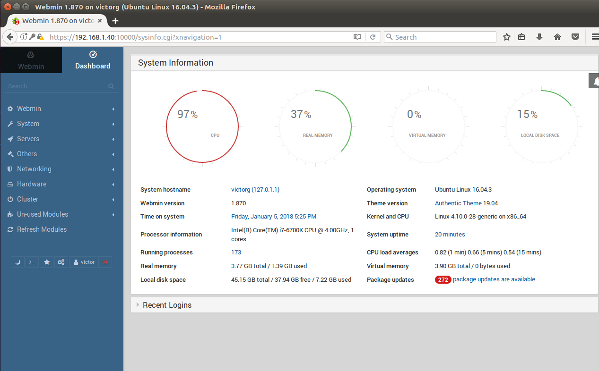

#  2. Configuración y uso de Webmin

+ Vamos a administrar las aplicaciones de prácticas anteriores por lo que vamos a la pestaña **Servers** y podemos ver que automaticamente, nos detecta nuestro Apache, Dns, Mysql.

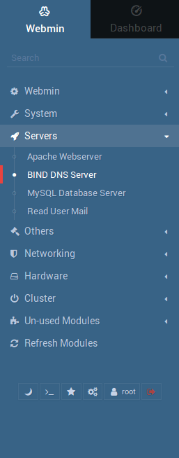

#### 2.1 Apache desde Webmin

+ En la opción Apache Webserver, podemos editar las opciones del servidor. Nos mostrará la configuración global, podremos ver los host virtuales que ya tenemos creado, añadir usuarios y grupos, etc...

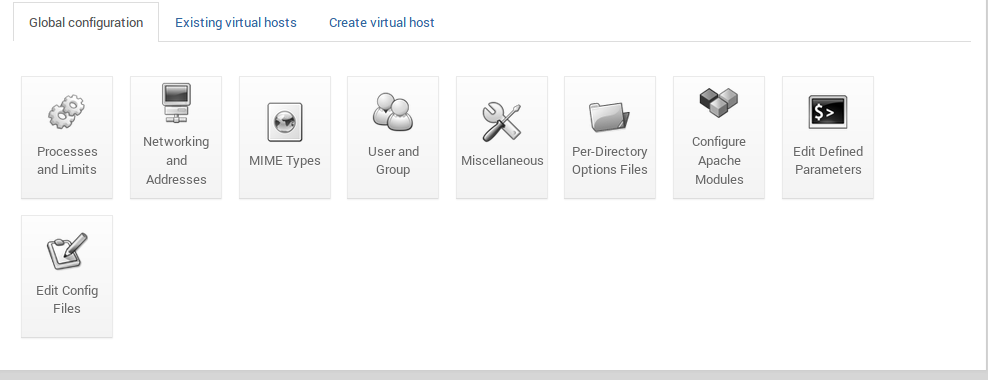

+ Podremos crear desde webmin los virtual host directamente.

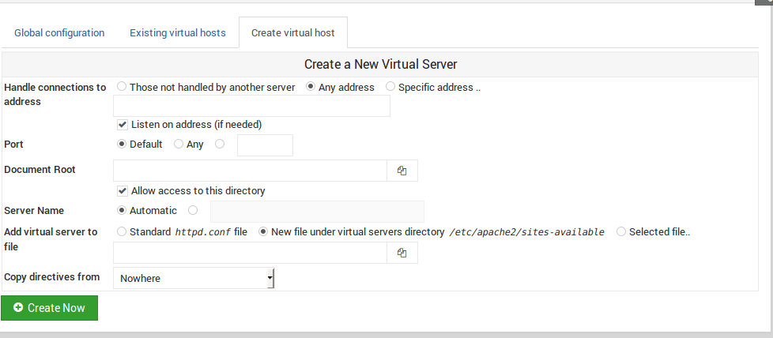

#### 2.2 MySQL desde Webmin

+ Podremos acceder a nuestra base de datos desde webmin con cualquier usuario creado en esta o como administrador.

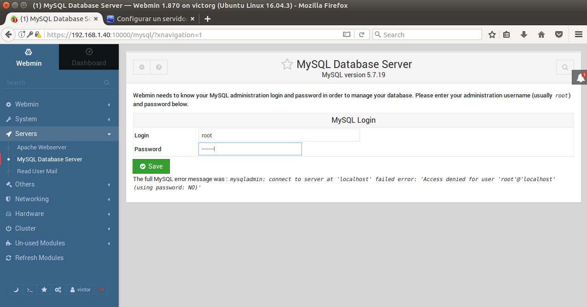

+ Nos logueamos y podremos administrar nuestra base de datos y editar sus opciones globales.

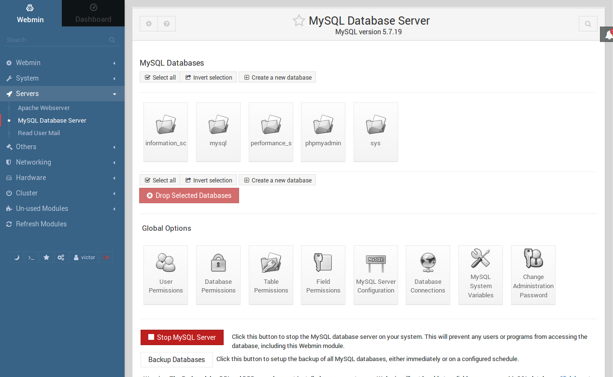

#### 2.3 DNS Server desde webmin

+ Cuando vamos a la pestaña **Bind DNS Server** encontraremos los distintos dominios creados en el servidor como por ejemplo miempresa.edu. Accederemos a él desde webmin.

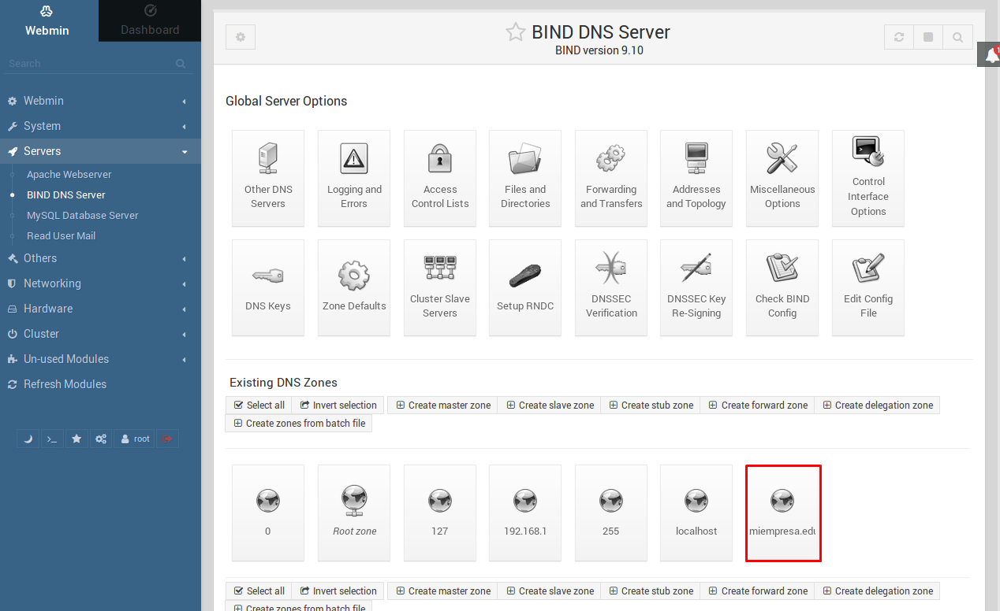

+ Ahora podremos añadir, editar y configurar cualquier opción desde la zona maestra.

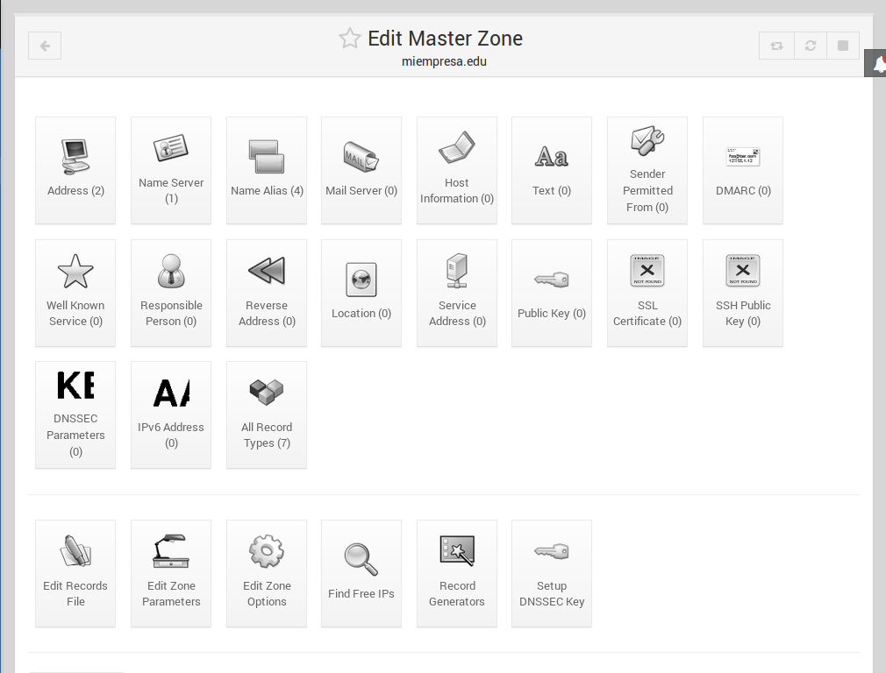

+ Vemos las direcciones guardadas

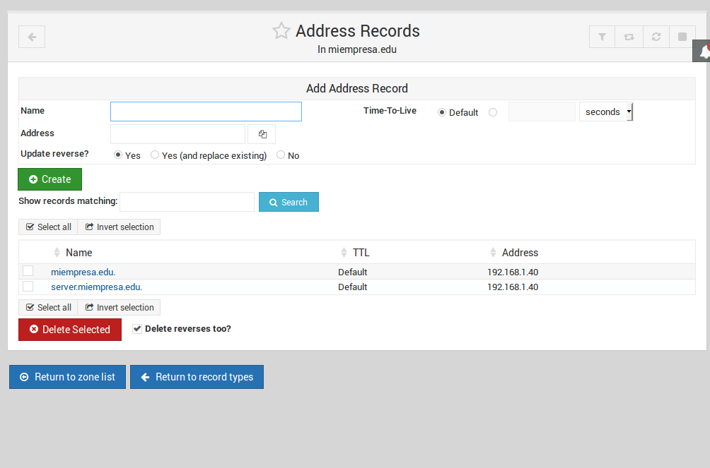

+ Vemos los servidores creados y podremos crear otros desde el panel de webmin.

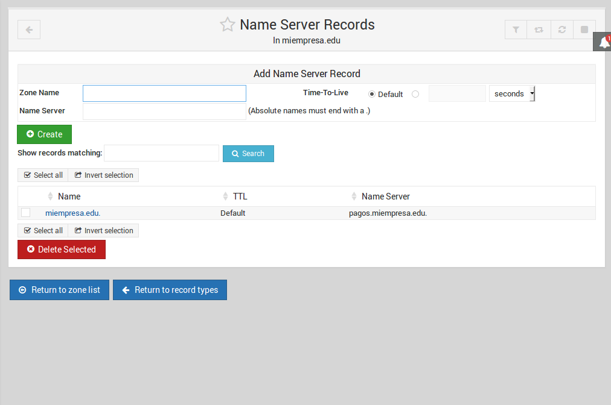

+ Los diferentes alias creados, etc...

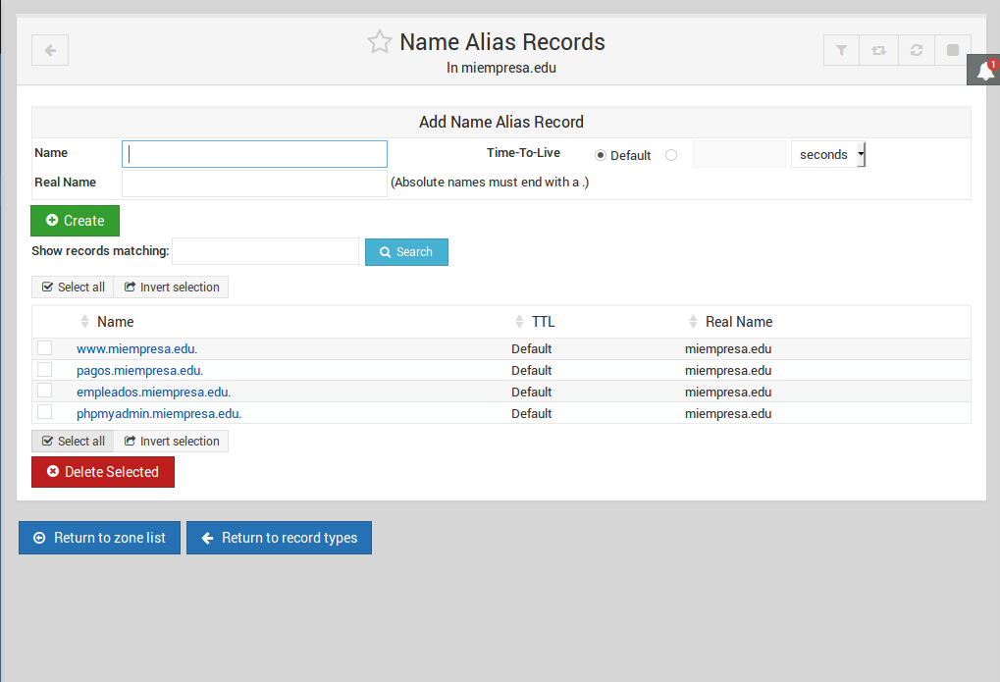

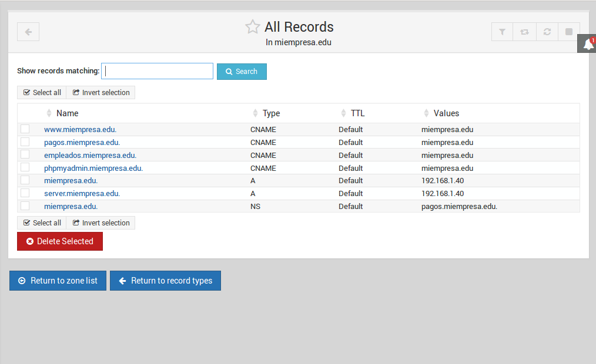

+ Desde webmin podremos editar, crear, borrar desde un entorno gráfico como si estuvieramos desde la misma consola del servidor.

#### 2.4 Diferentes opciones de Webmin

+ Desde webmin, a parte de administrar nuestras aplicaciones, podemos crear módulos para instalar estas aplicaciones automaticamente desde la misma plataforma. Tiene muchas posibilidades y podemos ver los recursos del servidor, añadir particiones etc...

+ Información del sistema

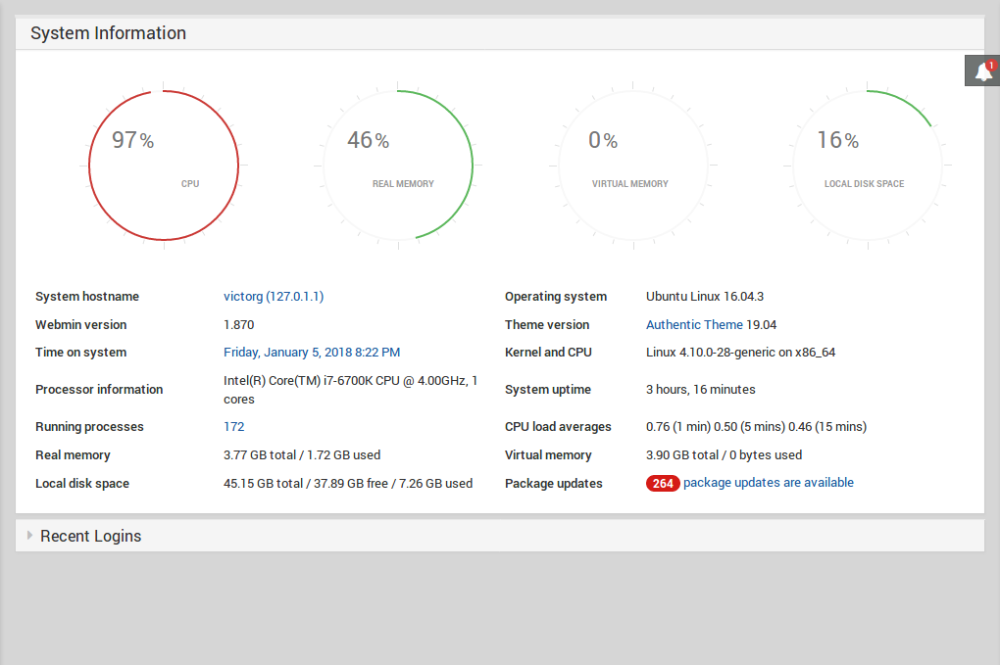

+ Backups y configuración de nuestros módulos y usuarios en Webmin.

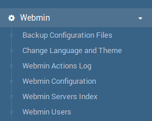

+ Control de particiones

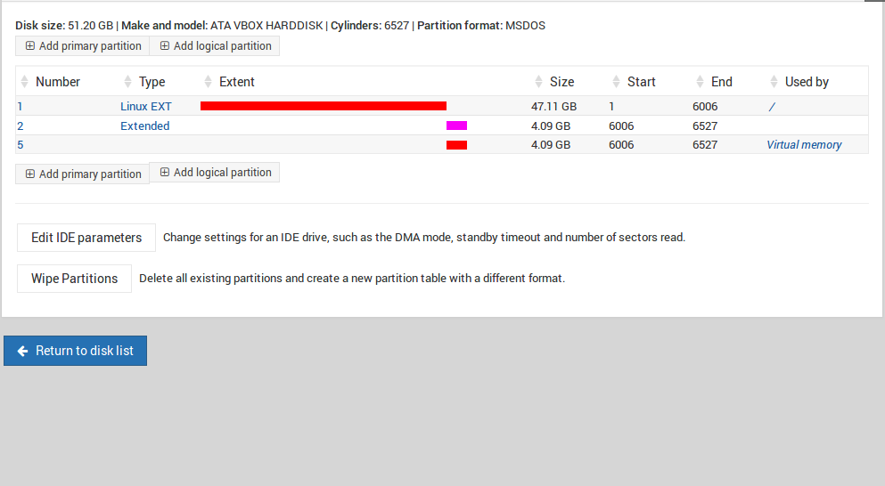

+ Una herramienta gratuita muy completa para configurar desde un único panel y dando acceso a los usuarios que queramos a todas nuestras aplicaciones anteriormente comentadas.

---
