>Práctica Realizada por:
>
>[Carlos Delgado Hernández](https://github.com/carlsjdh)
>
>[Carmelo González Domínguez](https://github.com/SilverGG)
>
>[Víctor García Luis](https://github.com/victorvgl)

---

# Apache Linux

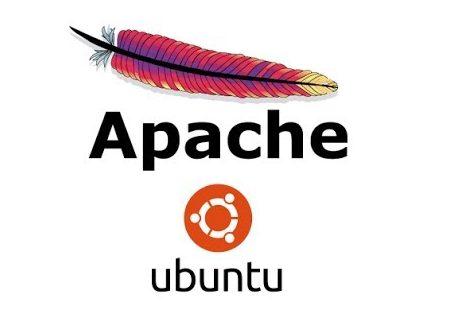

# Introducción

+ Vamos a realizar las instalaciones y configuraciones necesarias para obtener un Servidor Web con
soporte PHP y accesos a bases de datos relacionales, gestor de bases de datos.
Sobre este servidor, podremos realizar instalaciones de aplicaciones integradas (CMS, e-commerce, etc)

+ Crearemos un nuevo sitio Web denominado miEmpresa asociado una carpeta
 con acceso a través de la dirección "www.miEmpresa.com".

+ Comprobaremos  la instalación correcta de PHP colocando un fichero index.php en el sitio web destinado
a gestionar el CMS Drupal (www.miEmpresa.com

+ Comprobaremos  la instalación correcta de PHP colocando un fichero index.php en el sitio web destinado
  a gestionar el CMS Drupal (www.miEmpresa.com ó miEmpresa\principal) con el siguiente código:
  <?php phpinfo(); ?>

+ Crearemos un sitio web denominado "pagos" como subdominio de miEmpresa (pagos.miEmpresa.com) y configuraremos este último para ser accedido de forma segura, vía ‘https’ con un certificado autofirmado.

+ instalaremos el servidor de bases de datos relacionales MySQL

# Apache Linux

+ Instalamos apache `apt-get in apache2`

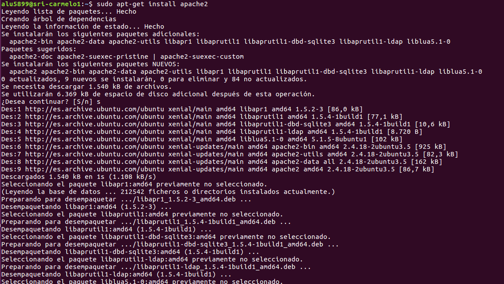

+ Comprobamos desde un navegador que podemos acceder correctamente desde nuestro localhost

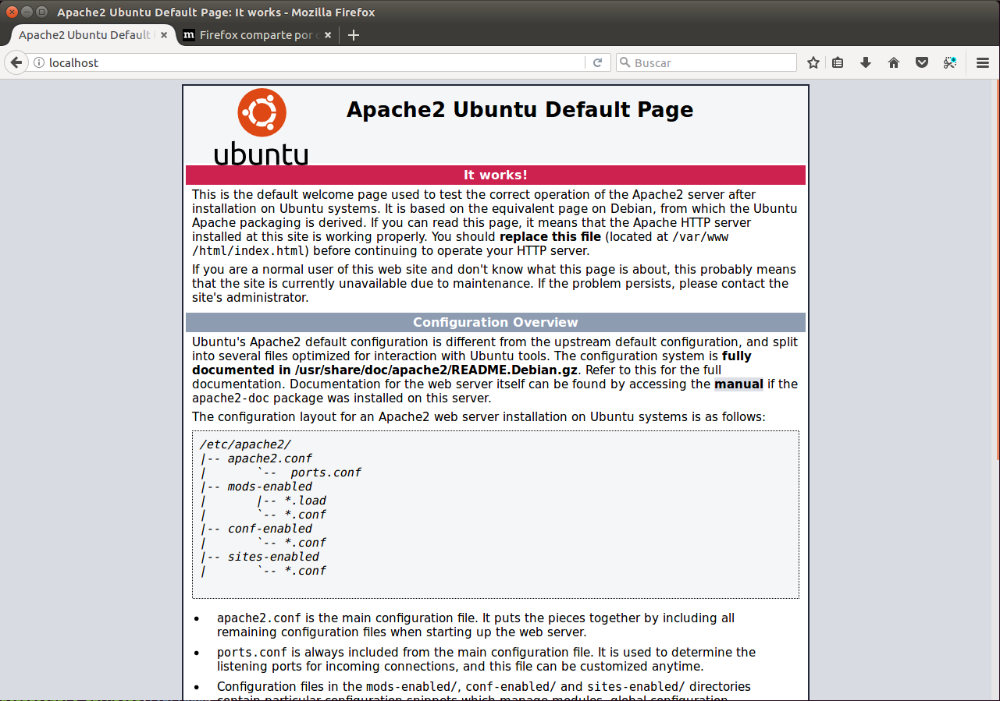

+ Creamos un DNS local, vamos al fichero de configuración `/etc/hosts` y añadimos la IP de nuestro servidor y el nombre del dominio.

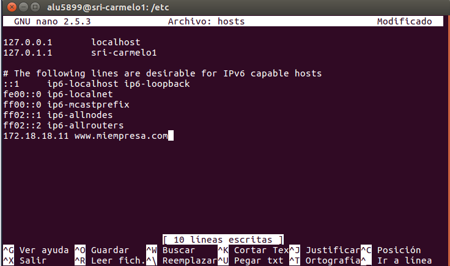

+ Comprobamos que podemos acceder y funciona correctamente

# PHP

+ Instalamos php

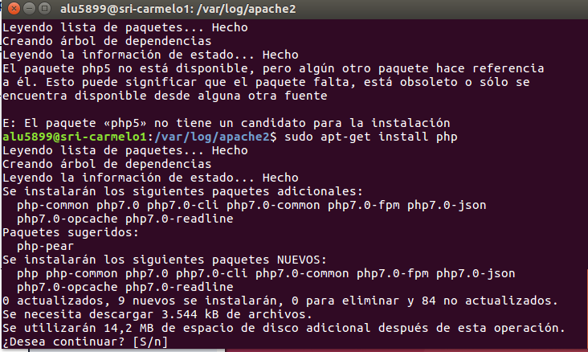

+ Instalamos las librerias necesarias para el funcionamiento de php

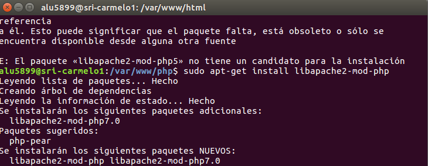

+ Vamos a la ruta `/var/www/html` y le cambiamos el **index.html por index.php**

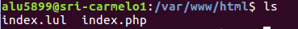

+ Comprobamos

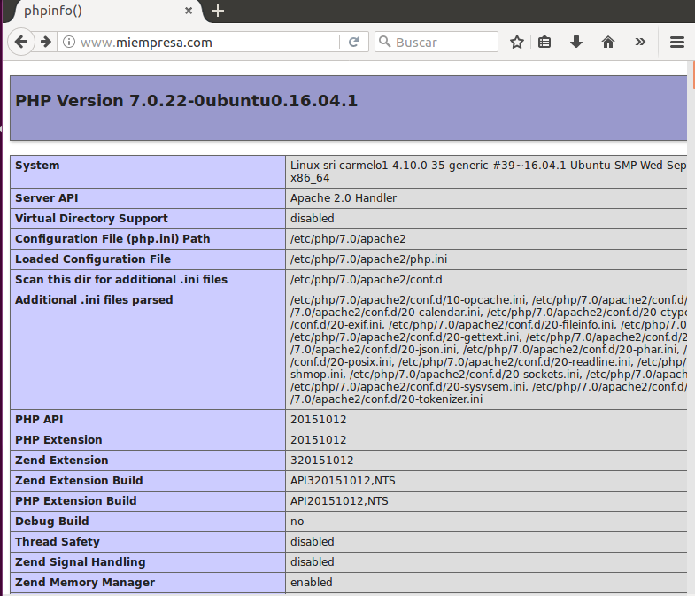

+ Añadimos al fichero de configuración los siguientes cambios con la ruta de de la carpeta empleados que creamos.

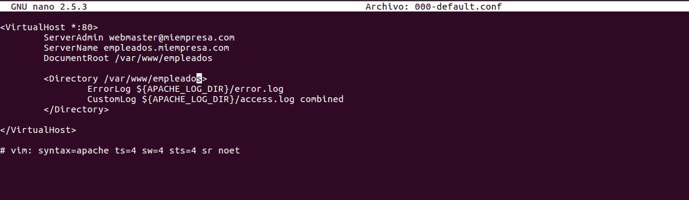

+ Generamos el certificado auto firmado

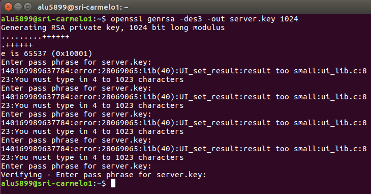

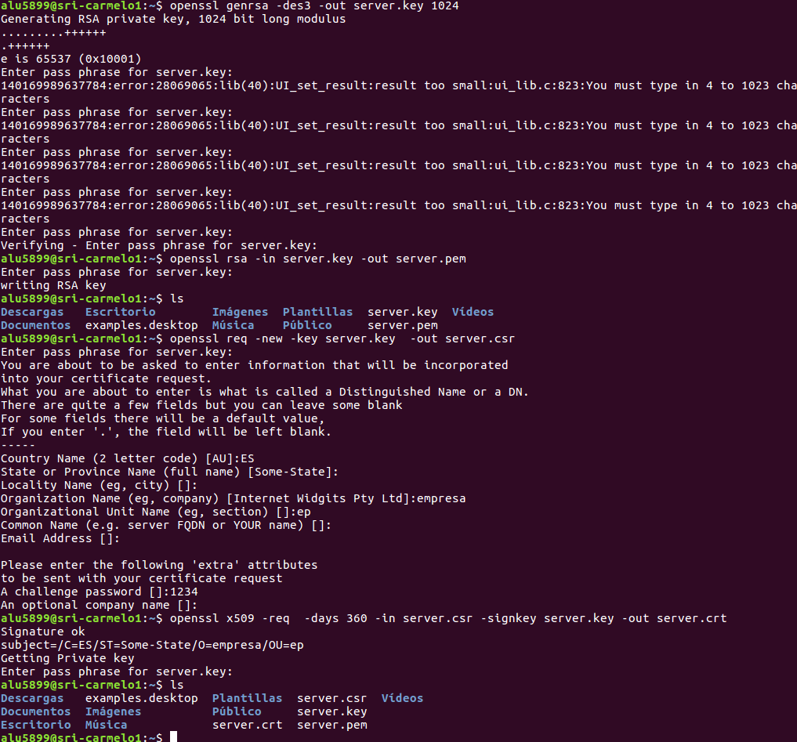

+ Comprobamos que tenemos las claves generadas

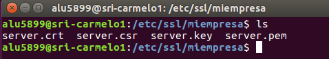

+ Añadimos al fichero de configuración lo siguiente:

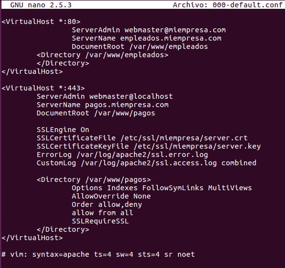

+ Añadimos un html al subdominio y comprobamos.

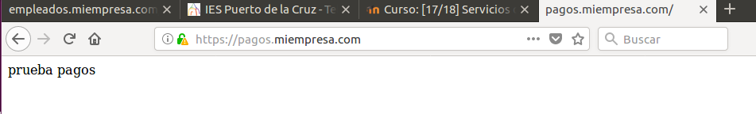

+ Creamos la carperta privada en `/var/www` y añadimos un usuario con una contraseña

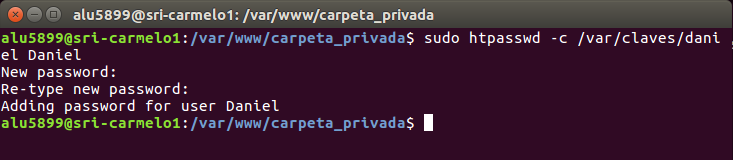

+ Comprobamos si se generó el htaccess

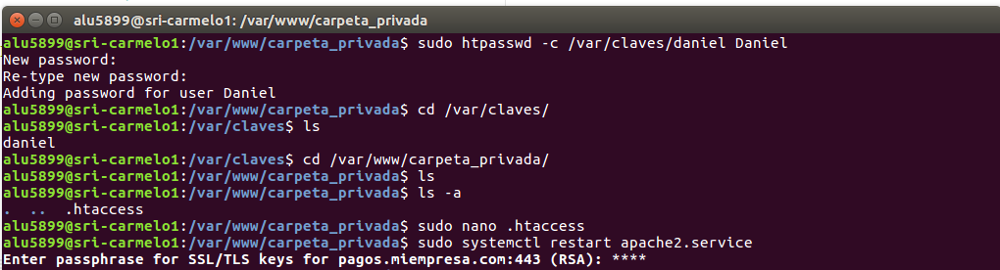

+ Volvemos al archivo de configuración y añadimos lo siguiente

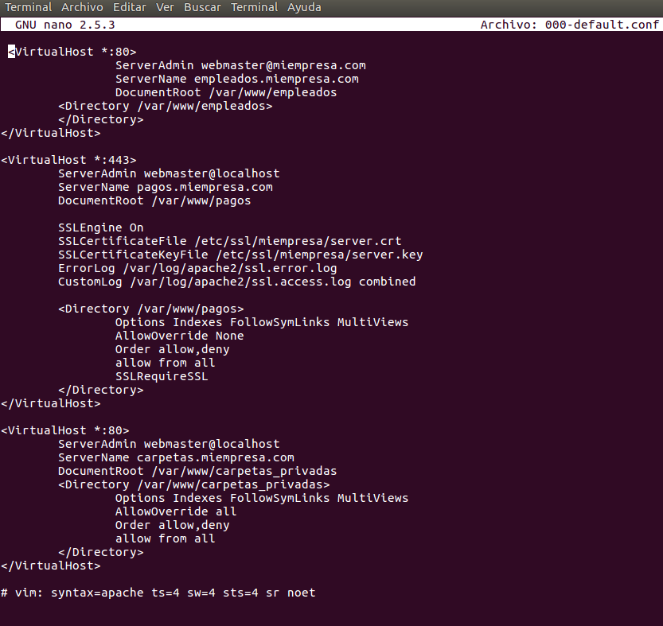

+ Comprobamos que al acceder nos  pide usuario y contraseña

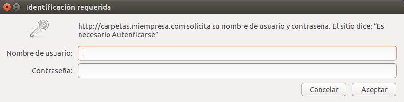

+ Accedemos correctamente con el usuario y contraseña anteriormente creados

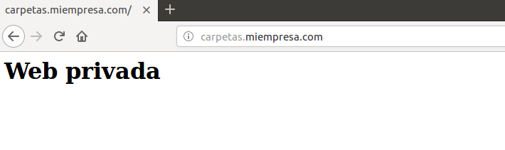

# Mysql y Phpmyadmin

+ Instalamos **mysql-server** y **phpmyadmin**

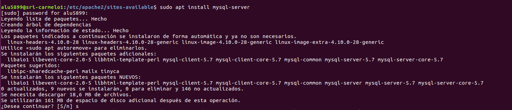

+ Comprobamos que está instalado

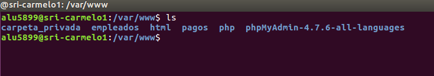

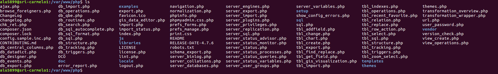

+ Accedemos desde el navegador y podemos ver que funciona correctamente

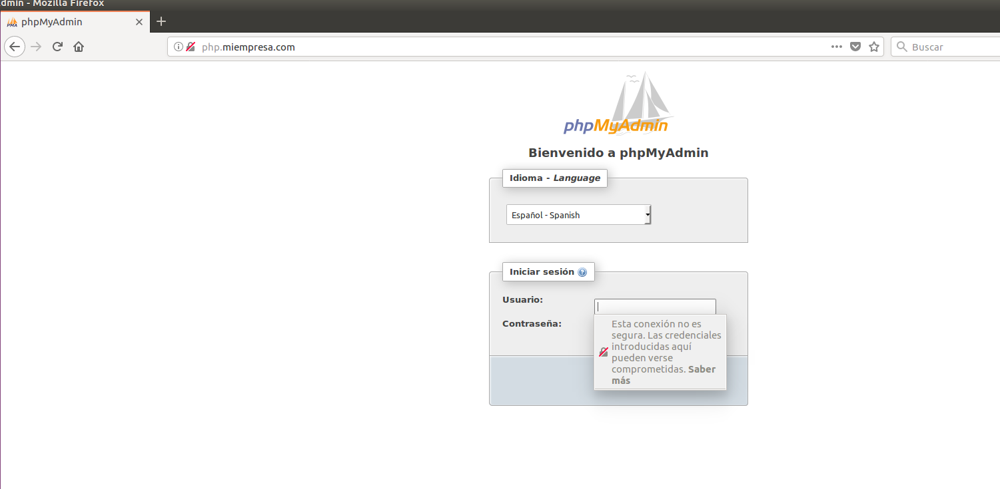

+ Comprobamos que podemos acceder

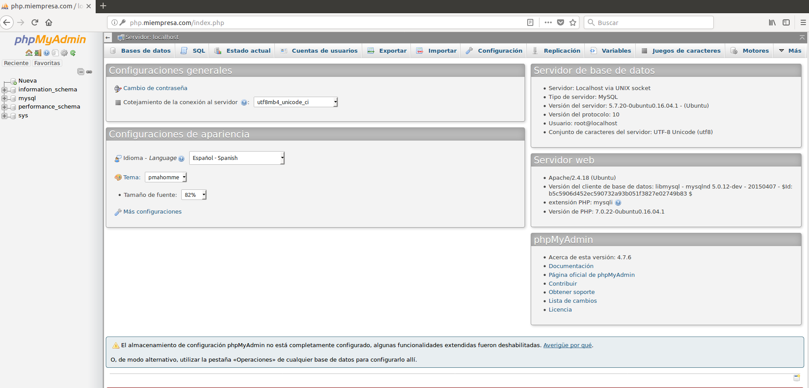

+ Añadimos al DNS **php.miempresa.com**

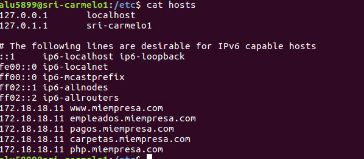

+ Añadimos al fichero de configuración lo siguiente:

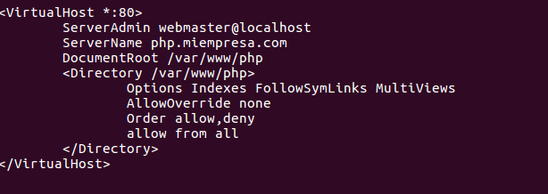

+ Creamos la base de datos cms y un usuario con todos los privilegios

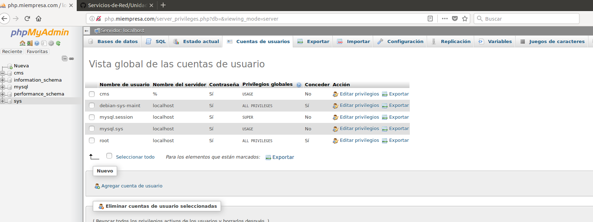

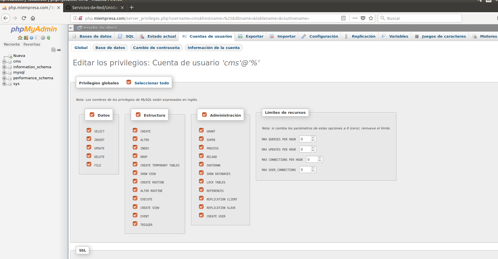

+ Volvemos al fichero de configuración y añadimos lo siguiente:

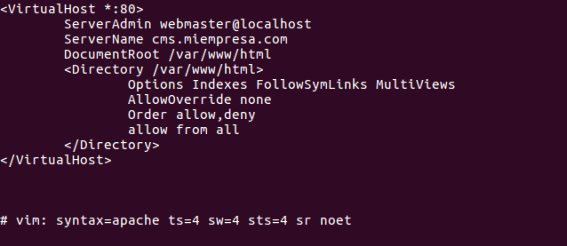

+ Añadimos al DNS **cms.miempresa.com**

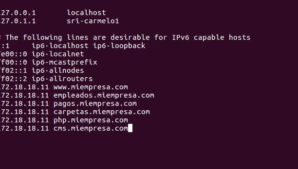

+ Nos descargamos **Drupal** del siguiente enlace [Enlace Drupal](https://www.drupal.org/)
 y lo ponemos en la carpeta asociada al virtual host de cms. Comprobamos que funciona correctamente

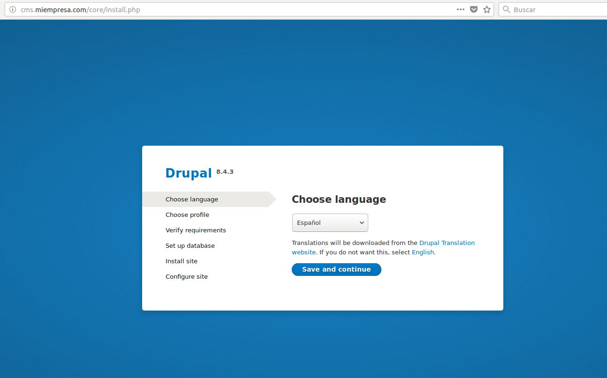
