# ISS Window Server

---

### [Práctica de IIS Windows 2012 Server IV](#1)

+ Crearemos una nueva zona de búsqueda directa en los servicios DNS asociado al
dominio miEmpresa y crearemos  la carpeta Miempresa con una subcarpeta
llamada principal.

+ Crearemos un nuevo sitio Web denominado miEmpresa asociado a la carpeta creada
anteriormente con acceso a través de la dirección (www.miEmpresa.com)

+ Crearemos un sitio web denominado "pagos" como subdominio de miEmpresa (pagos.miEmpresa.com) y configuraremos este último para ser accedido de forma segura, vía ‘https’ con un certificado autofirmado.

+ Crearemos un nuevo sitio seguro (tienda.miempresa.com) con la generación de
un Certificado Digital a través de la aplicación OpenSSL.

### [Práctica de IIS Windows 2012 Server IV B](#2)

+ Vamos  a  crear  un  nuevo  sitio  web  (empleados.miEmpresa.com) destinado a almacenar información privada de los empleados.

+ Crearemos carpetas privadas para cada usuario y una para todos los empleados

+ Los usuarios serán creados en Active directory con el nombre correspondiente de su carpeta de acceso.

---

#   1. IIS Windows 2012 Server IV

+ Vamos a los servicios DNS de nuestro servidor y creamos una nueva Zona de búsqueda directa.

+ Agregamos el dominio `miEmpresa.com` como nos indíca la práctica.

+ Seguimos los pasos de configuración hasta Finalizar el Asistente para la nueva zona.

+ Le añadimos un registro de host.

+ Le añadimos ( opcional) un alias para acceder con www.

+ Ahora vamos a los servicios ISS para agregar los sitios webs indicados en la práctica.

+ Añadimos los datos a agregar al sitio web.

+ Comprobamos su funcionamiento desde el servidor.

+ Volvemos a los servicios DNS para agregar el subdominio de miEmpresa denominado `pagos`.

+ Le añadimos un registro de host.

+ Le añadimos ( opcional) un alias para acceder con www.

+ Volvemos a los servicios ISS para agregar el nuevo sitio web.

+ Comprobamos su funcionamiento desde el servidor.

+ Comprobamos su funcionamiento desde el cliente.

## 1.1 Certificado autofirmado

+ Vamos al administrador del ISS y le damos a Certificados de servidor

+ Creamos un certificado autofirmado

+ Rellenamos el campo, el almacén de certificado como Personal y aceptar.

+ Ya tenemos el certificado creado.

+ Ahora modificamos el sitio web creado anteriormente.

+ Le cambios el `Tipo por https` y el puerto ` el puerto seguro 443`. Elejimos el nombre de certificado creado anteriormente.

+ Eliminamos el enlace a www.pagos.miempresa.com con el tipo http y desde el puerto 80.

+ Como podemos comprobar, funciona correctamente ya que no es una entidad certificadora oficial.

+ Podemos acceder perfectamente.

## 1.2 Solicitud del Certificado

+ Lo primero que vamos a hacer es añadir otro subdominio en miEmpresa.com llamado `tienda`

+ Le añadimos el registro host y un alias (opcional) www.

+ Agregamos el sitio web tienda.

+ Nos descargamos el [OpenSSL](http://moodle26.iespuertodelacruz.es/mod/resource/view.php?id=6943)

+ Realizamos la instalación del OpenSSL.

+ Vamos al administrador del ISS y `Creamos una solicitud de certificado`.

+ Rellenamos los campos requeridos para el certificado.

+ El proveedor de servicios `Microsoft RSA` y la Longitud en bits `2048`.

+ Guardamos la solicitud con el nombre `certreq.txt`.

+ finalizamos.

+ Comprobamos que se ha hecho la solicitud correctamente.

## 1.3 Certificado con OpenSSL

+ Lo primero que tenemos que hacer es meter en la carpeta `C:\OpenSSL\bin` la solicitud del certificado creada anteriormente. Luego, abrimos una consola y hacemos lo siguiente:

+ Generamos la clave privada, nos pide una contraseña para protegerla. `openssl genrsa -des3 -out cakey.pem 2048`

+ Ahora, hay que crear un certificado digital de la CA que contendrá información sobre la misma.. rellenamos toda la información que nos pide. Por linea de comando decimos que es válido por un año. `openssl req -new -x509 -key cakey.pem -out cacert.pem -days 365`

+ Vemos como queda el certificado

+ Ahora, creamos el certificado digital de nuestro Web.
`openssl x509 -req -days 365 -in certreq.txt -CA cacert.pem -CAkey cakey.pem -CAcreateserial -out iis.crt`

+ Vemos el certificado generado

+ Completamos la solicitud del certificado.

+ Le ponemos la ruta del certificado.

+ Agregamos el enlace de sitio

+ Podemos comprobar que ya tenemos generado los sitios con http y https especificado en la práctica y solo nos falta hacer las comprobaciones que podemos acceder perfectamente.

+ Comprobamos que nos avisa de un posible problema con la entidad certificadora cosa que es correcto ya que nosotros no somos ninguna empresa certificadora.

+ Comprobamos que podemos acceder desde el servidor con https

+ Comprobamos que podemos acceder desde el cliente con https.

+ Comprobamos que podemos acceder desde el servidor con http.

+ Comprobamos que podemos acceder desde el cliente con http.

#   2. IIS Windows 2012 Server IV B

+ Necesitamos  crear  una  carpeta  empleados  (dentro  de  miEmpresa)  y,  dentro  de  esta,  tres o cuatro subcarpetas personales con nombres de empleados y una, denominada común, a la que tendrán acceso todos los empleados, pero no otros usuarios sin identificar.

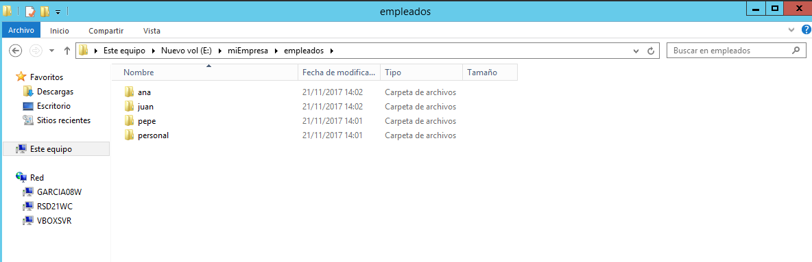

+ Crearemos  el  nuevo  sitio  web,  como  subdominio  de  nuestro  dominio  principal,  asociado a la carpeta genérica empleados.

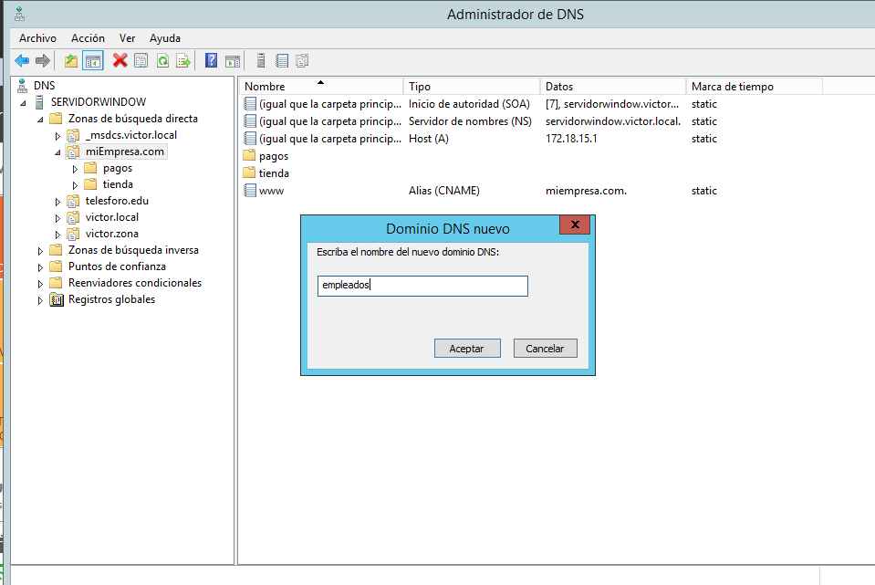

+ Le añadimos un registro host

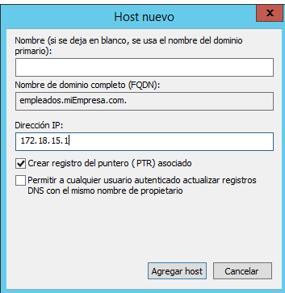

+ Agregamos un nuevo sitio web `empleados.miempresa.com`

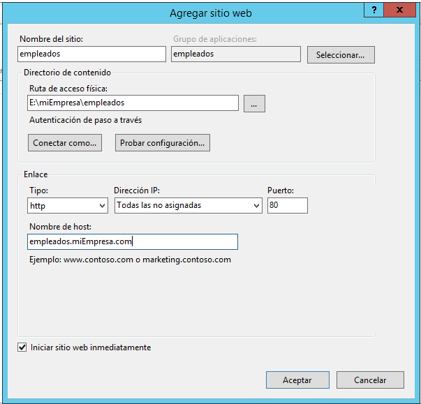

+ Activamos el `exámen de directorios` y comprobamos el acceso.

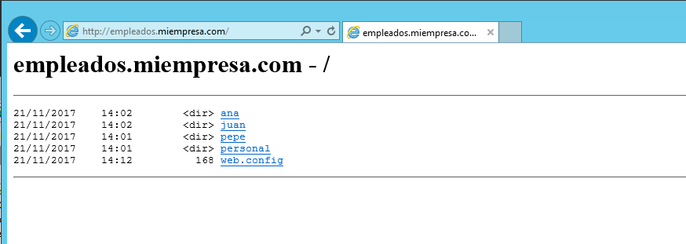

+ Añadimos un `index.html` en cada subcarpeta y comprobamos su acceso.

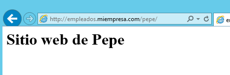

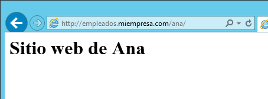

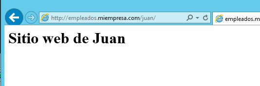

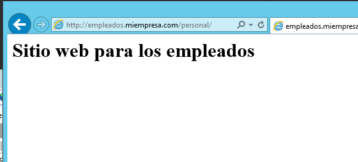

## 2.1 Autenticación

+ Ahora vamos a modificar en el servicio ISS la Autentificación anónima y básica.

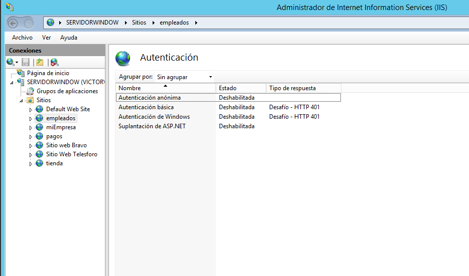

+ Le ponemos a empleados, la `Autenticación anónima deshabilitada` y la `Autenticación básica` Habilitada.

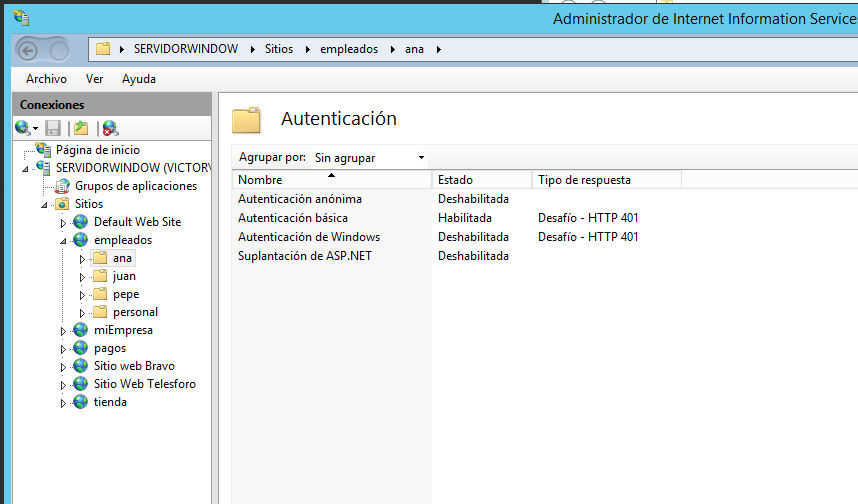

## 2.2 Usuario en Active Directory

+ Vamos al servicio de Active Directory

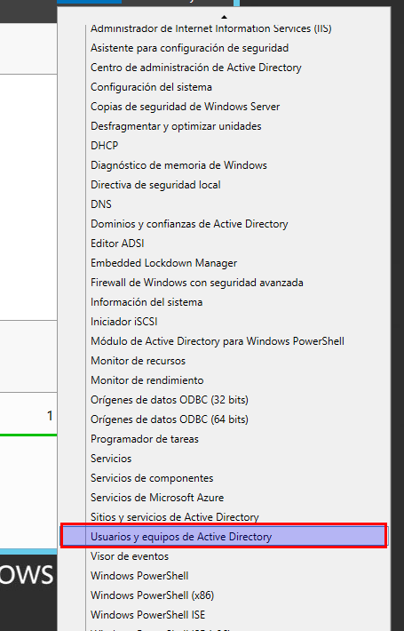

+ Creamos los Usuario anteriormente nombrados en las carpetas.

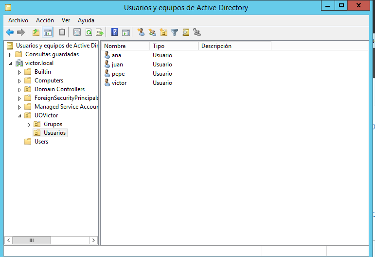

+ Creamos el grupo empleados.

 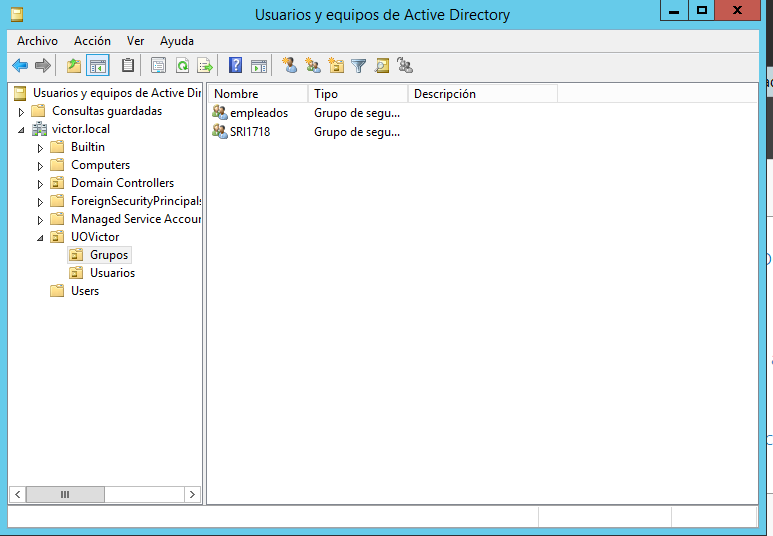

 + Añadimos al grupo empleados los usuarios creados anteriormente.

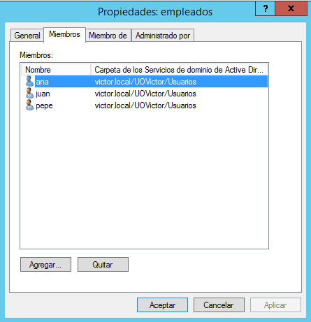

+ Ahora tenemos que deshabilitar las herencias antes de dar los permisos para que cada empleado acceda a su carpeta y todo puedan acceder a `personal`

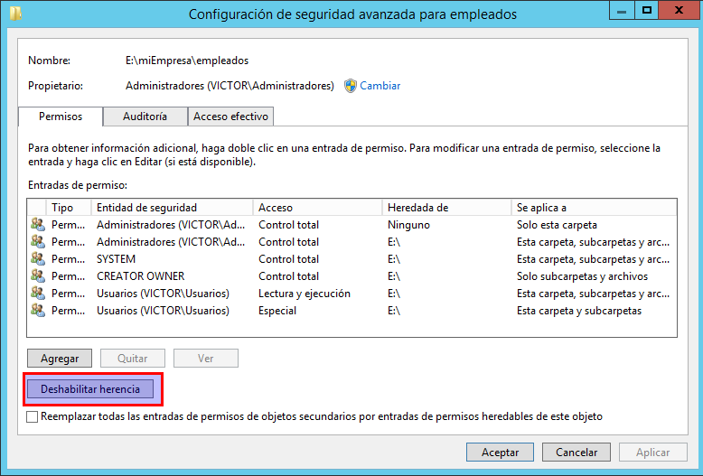

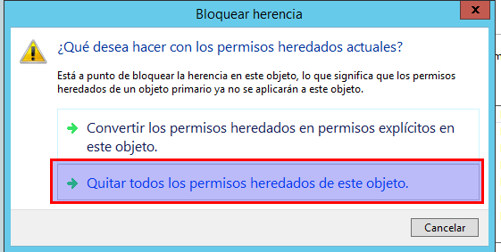

+ Para la carpeta empleados añadimos el grupo Administradores con control total y empleados creado anteriormente.

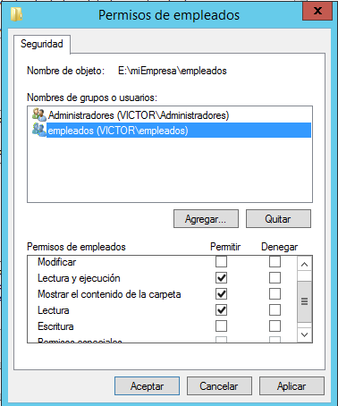

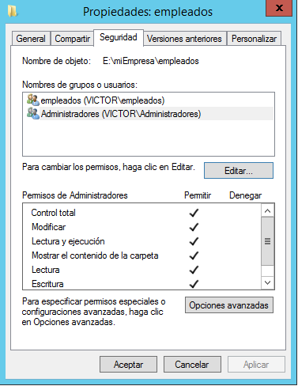

+ Ahora vamos a añadir el usuario a su carpeta correspondiente para que solo tenga acceso él y el administrador.

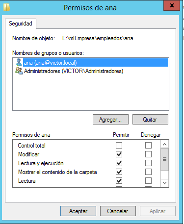

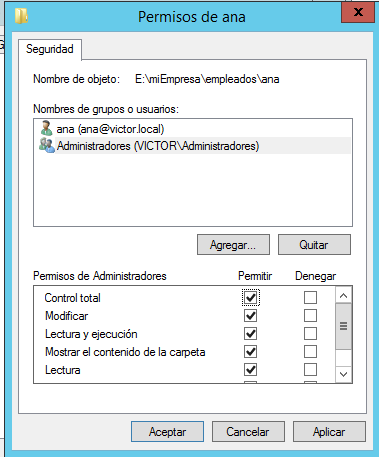

+ Hacemos lo mismo con los demás usuarios

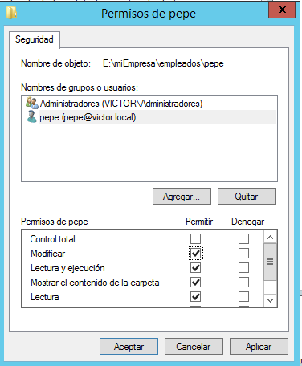

+ Añadimos el grupo empleados a la carpeta personal para que todos los usuarios tengan acceso con su login a esta carpeta.

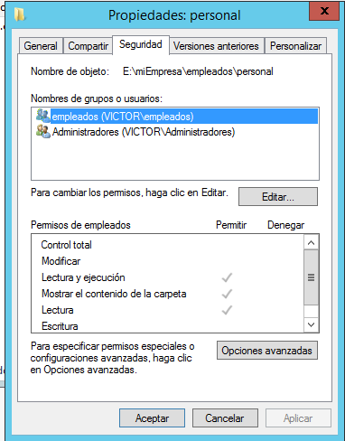

## 2.3 Comprobaciones

+ Comprobamos que podemos acceder con el usuario y password.

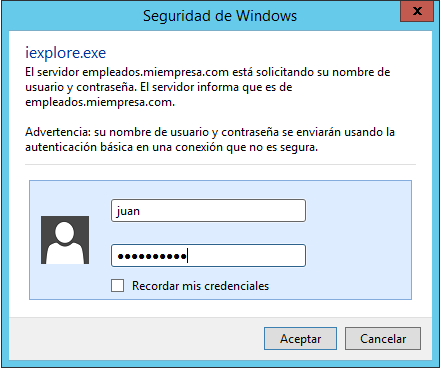

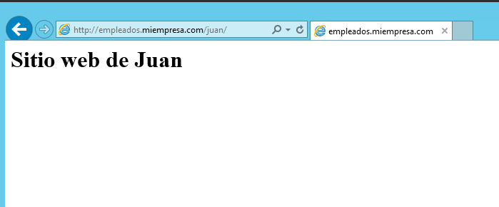

+ Comprobamos que no nos pide contraseña en la página principal creada en esta práctica y vemos las carpetas creadas en los pasos anteriores.

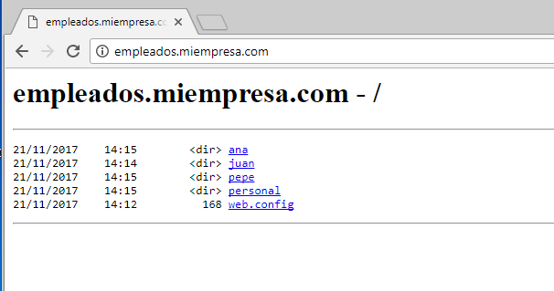

+ Comprobamos el acceso desde el cliente.

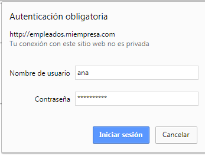

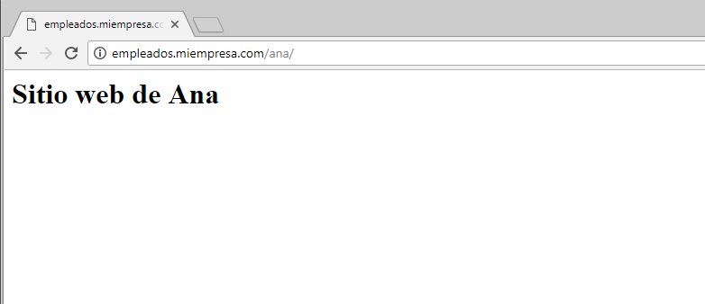

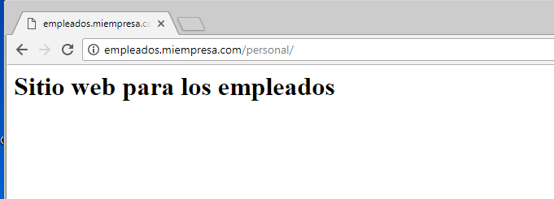

---
