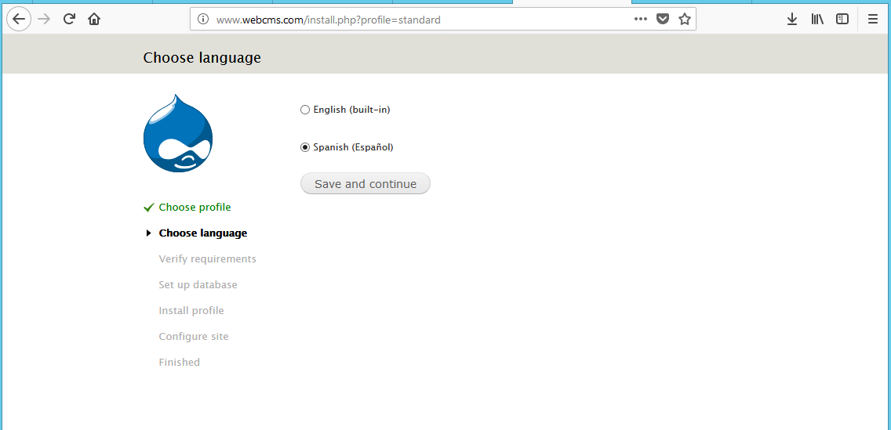

>Práctica Realizada por:
>
>[Carlos Delgado Hernández](https://github.com/carlsjdh)
>
>[Carmelo González Domínguez](https://github.com/SilverGG)
>
>[Víctor García Luis](https://github.com/victorvgl)

# ISS Window Server

---

### [Práctica de IIS Windows 2012 Server V](#1)

+ Vamos a realizar las instalaciones y configuraciones necesarias para obtener un Servidor Web con
soporte PHP y accesos a bases de datos relacionales, acceso FTP y gestor de bases de datos. Sobre
este servidor, podremos realizar instalaciones de aplicaciones integradas (CMS, e-commerce, etc)
desde el propio servidor o en modo remoto desde un cliente W7.

+ Crearemos un nuevo sitio Web denominado miEmpresa asociado a la carpeta creada
anteriormente con acceso a través de la dirección "www.miEmpresa.com".

+ Comprobaremos  la instalación correcta de PHP colocando un fichero index.php en el sitio web destinado
a gestionar el CMS Drupal (www.miEmpresa.com ó miEmpresa\principal) con el siguiente código:
<?php phpinfo(); ?>

+ Crearemos un sitio web denominado "pagos" como subdominio de miEmpresa (pagos.miEmpresa.com) y configuraremos este último para ser accedido de forma segura, vía ‘https’ con un certificado autofirmado.

+ instalaremos el servidor de bases de datos
relacionales MySQL para tus sitios Web gestionados por IIS

### [Práctica de IIS Windows 2012 Server VI B](#2)

+ Instalaremos un Servidor FTP FileZilla en Windows 2012 Server con un usuario de prueba para acceder desde un cliente y un registro DNS para acceder al sitio a través de la dirección `ftp.miEmpresa.com`

+ Comprobaremos accesos desde el cliente a phpMyAdmin desde un navegador `phpmyadmin.miEmpresa.com`. Comprobaremos el acceso al sitio ftp creado anteriormente
a través del navegador y a través de filezilla.

+ Descargaremos CMS Drupal dodne configuraremos y crearemos el sitio drupal.

### [Práctica de IIS Windows 2012 Server VII B](#3)

# 1. Instalación y configuración php en Window Server

+ Nos descargamos el instalador del siguiente [Enlace](http://windows.php.net/download/)
y realizamos la instalación.

+ Realizamos la instalación

+ Elegimos la opción ISS FastCGI

+ Necesitamos instalar roles CGI para poder activar el FastCGI

+ Instalamos el CGI

+ Seguimos con la instalación por defecto.

+ Añadimos el sitio web que vamos a utilizar, en este caso, `php` y le ponemos como prioridad el index.php.

+ Creamos las carpetas del dominio y subdominio donde vamos a crear el index.php

+ Ahora vamos a crear el dominio `webcms.com` y el subdominio `php`

+ Probamos el acceso.

+ Ahora vamos a instalar el `mysql-server` desde el siguiente [enlace](http://dev.mysql.com/downloads/installer/
.)

+ Empezamos con la configuración

+ Lo configuramos solo como server

+ Tipo server machine, puerto 3306 y le damos acceso al cortafuego.

+ Comprobamos que se instala todo correctamente

+ Creamos el usuario en el servidor `php_user` y probamos que podemos acceder desde el cliente

+ Accedemos desde el cliente

---

#   1. IIS Windows 2012 Server V

+ Instalamos Filezilla en el servidor

+ Seguimos con la instalación por defecto

+ Creamos la carpeta `ftp_users`

+ Añadimos un usuario llamado `ftpuser` y le damos permisos.

+ Elegimos el directorio de webcms que es donde queremos acceder desde fuera

+ Comprobamos el acceso desde el servidor vía web

+ Podemos acceder correctamente

