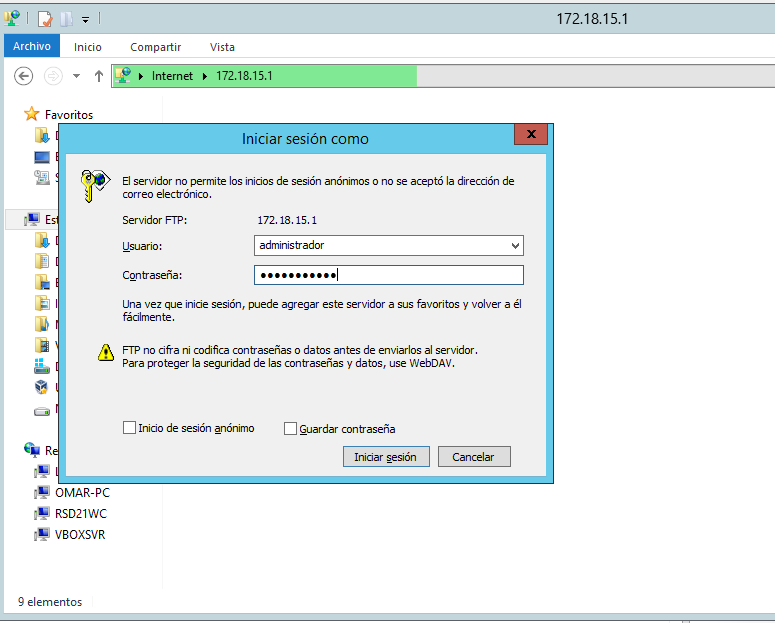
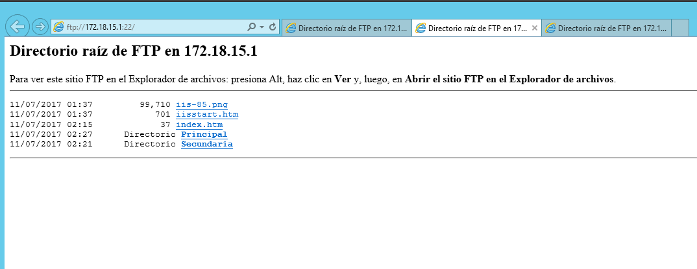

# FTP WINDOW SERVER Y LINUX

---

## [Práctica de FTP en Windows 2012 Server](#1)

+ Instalaremos el Servicio FTP en Windows 2012 Server, a través de Agregar roles y características (IIS)

+ Accederemos a la creación y configuración de Sitios FTP por medio de la Administración de IIS.

+ Crearemos tres sitios FTP asociados a rutas y carpetas y probaremos diferentes configuraciones.

+ Haremos diferentes comprobaciones desde un cliente, tanto por web como por software.

## [ Práctica de Instalación y Configuración del Servicio FTP en Linux Ubuntu](#2)

+ Instalaremso el servicio SSH en el servidor Linux.

+ Crearemos dos usuarios con diferentes niveles y privilegios de acceso al fylesystem.

+ Haremos varias comprobaciones por SSH.

+ Probaremos diferentes operaciones de acceder, compartir, subir y descargar archivos entre servidor y cliente.

---

#   1. Servidor FTP Window Server

### Instalación

+ Comenzamos `agregando roles y características` en Window Server.

+ Seguimos los pasos de configuración y desplegamos la casilla **Servidor web (ISS)** marcar
la casilla Servidor FTP.

+ Confirmamos la selección de instalación.

+ Iniciamos la instalación.

### Sitio FTP 1

+ Vamos al Administrador del (ISS) y Agregamos un nuevo sitio FTP.

+ Agregamos el nuevo sitio y como se especifica en la práctica, la **Ruta de acceso física** será C:\

+ Ponemos la dirección IP de nuestro servidor, que inicie automaticamente y **Sin SSL**

+ Solo el usuario Administrador tendrá acceso al sitio, sin acceso anónimos y en modo lectura y escritura.

+ Añadimos un nuevo subdominio `ftp.miEmpresa.com`

+ Empezamos las comprobaciones y comprobamos que podemos acceder con nuestro usuario y contraseña desde un navegador.

+ Podemos acceder correctamente.

+ Comprobamos que podemos acceder desde el navegador de un cliente.

+ Comprobamos que podemos acceder desde el explorador de archivos.

+ Podemos acceder correctamente

+ Nos descargamos el software WinSCP en el cliente Windows desde este [Enlace](https://winscp.net/eng/download.php), y realizamos la instalación.

+ Configuramos la conexión al sitio ftp y establecemos la conexión.

+ Funciona correctamente.

### Sitio FTP 2

+ Creamos otro sitio FTP y esta vez asociado a `C:\inetpub\wwwroot` con otro subdominio a nuestro dominio `ftp2.miempresa.com`

+ Dirección IP de nuestro servidor, inicio automático y esta vez si Permitimos un certificado SSL. Usaremos el certificado creado en prácticas anteriores.

+ Los accesos anónimos no estarán permitidos, todos los usuarios podrán acceder y tendrán permisos de lectura y escritura.

+ Comprobamos la conexión desde WinSCP y como podemos ver, nos detecta el certificado y nos avisa que no es un certificado oficial, osea, todo correcto.

+ Comprobamos la conexión.

+ Podemos acceder correctamente.

### Sitio FTP 3

Creamos otro sitio FTP y esta vez asociado a `una carpeta del servidor` con otro subdominio a nuestro dominio `ftp3.miempresa.com`

+ Ponemos la IP de nuestro servidor, inicio automático y sin certificado.

+ Daremos acceso a usuarios anónimos y solo se podrá consultar y leer.

+ Comprobamos desde el navegador del servidor.

+ Comprobamos desde el navegador del cliente.

### Configuración para tener los tres sitios en funcionamiento simultaneamente.

+ Tendremos que tener los subdominios creados en nuestro dominio, en mi caso los he creado todos anteriormente como se puede comprobar en la siguiente imágen.

+ Luego tendremos que cambiarle el puerto de los sitios ftp para asignarles un puerto diferente
a cada uno y así poder entrar a los tres sin necesidad de parar ninguno.

+ Comprobaciones de acceso de los tres sitios FTP simultaneamente, tanto por IP como por dominio.

---

#   1. Servicio FTP Linux

+ Instalamos el Servicio **SSH** `apt-get install ssh`.

+ Creamos dos cuentas de usuarios con diferentes privilegiso y niveles de acceso al filesystem.

+ Comprobamos que podemos acceder con el usuario1 al servidor por SSH.

+ Comprobamos que podemos acceder con el usuario2 al servidor por SSH.

+ Comprobamos que podemos lanzar una aplicación a través de SSH desde el servidor hacia Linux.

+ Comprobamos que podemos acceder y obtener un archivo por `sftp` desde el usuario1.

+ Comprobamos que podemos acceder y obtener un archivo por `sftp` desde el usuario2.

+ Comprobamos que podemos subir un archivo por `scp` desde el usuario1 y usuario2.

+ Instalamos el paquete **proftpd** `apt-get install proftpd`

+ El fichero de configuración se encuentra en la ruta `/etc/proftpd` y es el fichero que modificaremos según las necesidades que queramos.

+ Algunos parámetros a modificar del archivo de configuración.

  + **DefaultRoot** -> Descomentamos borrando la almohadilla #. Esto nos va a permitir que cuando cada usuario acceda a su cuenta del FTP, estos accederán directamente a su carpeta “home”. Si queremos que todos los usuarios que inicien sesión accedan por defecto a una misma carpeta, debemos cambiar el parámetro DefaultRoot y añadir la ruta a la que queramos que accedan.

  + **ServerName** -> Nos permite establecer un nombre al servidor.

  + **AccessGrantMsg** -> Mensaje de bienvenida.(Hay que añadirlo manualmente al final del archivo).

  + **AccessDenyMsg:** -> Mensaje de error al iniciar.(Hay que añadirlo manualmente al final del archivo).

+ Comprobamos que podemos acceder con el usuario1 y usuario2.

+ Comprobamos que podemos subir un archivo por ftp.

---
