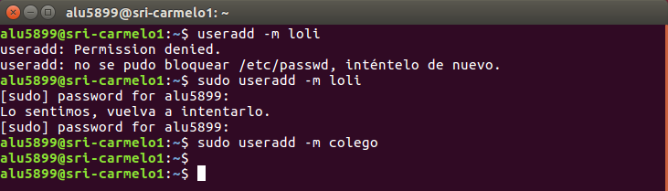
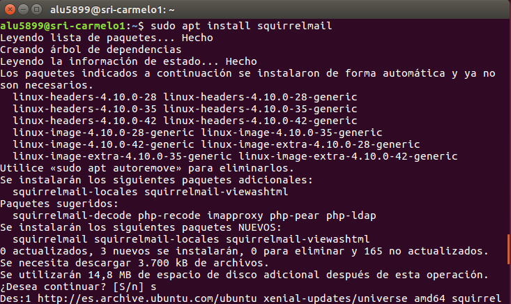

>Práctica Realizada por:
>
>[Carlos Delgado Hernández](https://github.com/carlsjdh)
>
>[Carmelo González Domínguez](https://github.com/SilverGG)
>
>[Víctor García Luis](https://github.com/victorvgl)

# Servidor de correo Linux

---

### [Instalación de Postfix](#1)

+ Instalamos *Postfix* con `sudo apt install postfix` y se nos desplegará una ventana de configuración del servicio.  

# 

  

+ Escogemos *Sitio de Internet*.

+ Establecemos *miempresa.com* como dominio del que hará uso *Postfix*.  

+ Comprobamos con *netstat -utap* que el servicio *smtp* esta en modo escucha.  

+  Añadimos los usuarios *loli* y *colego* (necesarios para la comprobación del funcionamiento del servicio *smtp*).  

+  Una vez creados, accedemos al puerto 25 vía *telnet* y mandamos un correo de *loli* a *colego*.  

+ Para acceder al buzón de *colego*, nos dirigiremos a `/var/spool/mail/` donde podremos comprobar que ha recibido el correo de *loli*.  

+ Nos dirigimos al cliente, e instalamos *evolution* (un gestor de mensajería).  

+ Establemos los enlaces en el *DNS* local al servidor, los dominios *smtp.miempresa.com* y *pop.miempresa.com*.  

+ s

+

+

+

+

+

+

+

+

+

+

+

+

+

+

