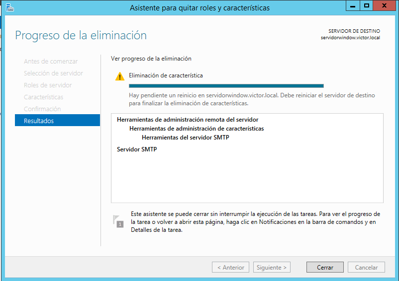
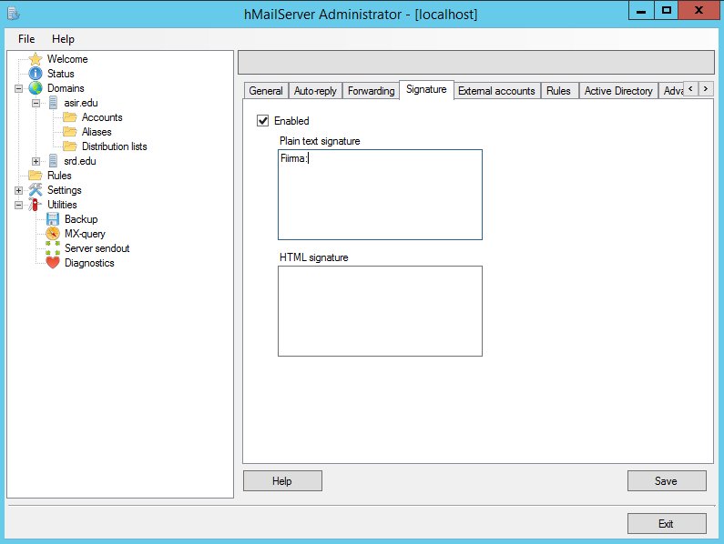

# Servidor de Correo

---

### [Instalación y Administración de Servicios de Correo Electrónico](#1)

+ Instalaremos el Servicio SMTP en Windows 2012 Server y haremos la siguiente configuración:

  + Establecer como IP todas las asignadas
  + Limitar el número de conexiones a 50
  + Habilitar el registro en formato W3C, diario y en una carpeta determinada
  + Configurar envío de mensajes dentro de nuestra red local: Aceptar la conexión al servidor y la retransmisión de mensajes a todos los equipos menos los que aparecen en la lista (incluir una IP cualquiera en la lista para impedir su acceso y retransmisión)
  + Establecer autenticación anónima
  + Comprobar la existencia del dominio AD predeterminado. Crea un dominio de tipo alias para disponer de cuentas en otro dominio.
  + Configuraremos diferentes configuraciones y haremos las pruebas desde un cliente con Opera Mail.

### [Instalación y Administración de Servicios de Correo Electrónico con hMailServer](#2)

+ Vamos a configurar hMailServer en Window Server 2012. Instalaremos el programa y configuraremos dos dominios `asir.edu` y `srd.edu` con dos cuentas para dos usuarios ficticios. Configuraremos el servidor DNS y haremos una serie de configuraciones de prueba dentro de hMailServer. Realizaremos una serie de pruebas desde un cliente.

---

#   1. Instalación y Administración de Servicios de Correo Electrónico

+ Vamos al Administrador del servidor `Agregar roles y características` y agregamos el ISS.

+ Iniciamos el asistente para agregar roles y características.

+ Seguimos los pasos como siempre hasta llegar a características para agregar el Servidor SMTP.

+ Agregamos características.

+ Iniciamos la instalación.

+ Vamos al Administrador ISS 6.0

+ Configuramos el Servidor SMTP, ponemos la dirección IP de nuestor servidor limitando el número de conexiones a 50 y habilitar el registro en formato W3C.

+ Ahora vamos a acceso, Conexión para agregar o denegar acceso.

+ En mi caso, solo voy a dar acceso al cliente por lo que pondré la IP que tengo asignada en él.

+ En retransmisión, le daré permiso de retransmisión a todos los equipos que se autentican correctamente.

+ Configuración del Mensaje

+ Configuración de la entrega.

+ Añadimos el acceso anónimo a la autentificación.

+ En enrutamiento LDAP, desactivado.

### Creando el dominio SMTP

Ya con le Servidor SMTP configurado, vamos a crear desde este un nuevo dominio SMTP.

+ Especificamos el nuevo dominio como alias.

+ Añadimos el dominio que queramos.

+ Comprobamos que las carpetas en la ruta `C:/inetpub/mailroot`

### Cliente

+ Nos descargamos el instalador de Opera Mail en el siguiente [Enlace](http://www.opera.com/es/computer/mail) y hacemos la instalación.

+ Seguimos el asistente de  configuración de correo.

+ Añadimos el servidor de entrada y salida, en mi caso, la ip del servidor de correo.

+ Hacemos una prueba y comprobamos que nos llega correctamente el correo enviado.

### Cifrado TLS

+ Vamos hacer otra prueba pero ahora con cifrado TLS y autentificación básica. Marcamos el cifrado TLS y vamos a Autenticación.

+ En Autenticación, marcamos la Autenticación básica, que requiere el cifrado TLS y el dominio predeterminado `victor.local`.

### Cliente

+ Volvemos al cliente, y en propiedades de la cuenta, pestaña Servidores, marcamos la Conexión segura TLS.

+ Aceptamos el certificado, es normal que nos avise que los firmantes no están registrados ya que no es un certificado oficial.

+ Volvemos hacer la prueba y nos llega correctamente.

+ Comprobamos que dentro de las carpetas, nos aparecen los correos.

#   2. Instalación y Administración de Servicios de Correo Electrónico con hMailServer

### Configuración inicial

+ Lo primero que tenemos que hacer, es quitar el Servidor SMTP de la práctica anterior para que no nos de conflicto con el hMailServer. Vamos a quitar roles y características y lo quitamos.

+ Confirmamos que queremos quitar el servidor SMTP.

+ Lo segundo que tenemos que hacer para que el hMailServerfuncione correctamente, es instalar el Framework 3.5, vamos a agregar roles y características y lo instalamos.

### hMailServer

+ Nos descargamos hMailServer del siguiente [Enlace](https://www.hmailserver.com/download) y realizamos la instalación.

+ Entramos a la interfaz para empezar a configurar el hMailServer.

+ Agregamos dos nuevos dominios, `asir.edu` y `srd.edu`

+ Agregamos en el apartado backup, una carpeta creada anteriormente para hacer las copias de seguridad.

+ Hacemos y Diagnóstico y comprobamos que no nos da error en Backup desde los dos dominios.

asir.edu

srd.edu

+ Añadimos dos cuentas a cada dominio, una de ellas, con una configuración diferente para ver algunas de las distintas opciones que podemos configurar.

+ Añadimos el nuevo usuario cambiándole el tamaño máximo que puede subir.

+ Podemos configurar una respuesta automática con la fecha que queramos en la pestaña Auto-reply.

+ En la pestaña Forwading, podemos agregar un correo para que los correos entrantes a esta cuenta sean enviados a la que queramos.

+ En la pestaña signature, podemos añadir un texto o html automaticamente.

+ Creamos el otro usuario en el dominio con una configuración diferente.

+ Creamos los otros dos usuarios en el otro dominio.

+ Podemos poner rangos de IP y varios protocolos de correo. Tanto para el servidor como para los clientes.

+ Es importante, que desmaquemos el autoban para que podamos enviar y recibir los correos.

### Administrador DNS

+ Vamos al administrador DNS del servidor y añadimos dos nuevas zonas de búsqueda directa con el nombre de nuestro dominios y le añadimos un host A apuntando a nuestro servidor mediante su IP y un Intercambiador de correos MX apuntando al Hosta A.

+ Como podemos comprobar, al hacer el diagnóstico, ya no nos da ningún error.

asir.edu

srd.edu

### Cliente

+ Ahora vamos hacer una serie de pruebas desde el cliente. Comprobamos que podemos enviar y recibir desde un usuario a otro.

+ Funciona correctamente.

### Lista de distribución

+ Vamos hacer otra prueba con una lista de distribución. Crearemos una lista y añadiremos a esta la configuración y los usuarios de correo que queramos para redirigir el correo entrante a estos.

+ Añadimos los usuario que queramos a la lista de distribución.

+ Hacemos una prueba mandado un correo a `empleados@asir.edu` que es el nombre de la lista que he creado con los usuarios victor@asir.edu y alfon@asir.edu.

+ Mandando un correo de prueba, automaticamente nos llega a los usuarios añadidos a la lista.

+ Comprobamos el contenido y que nos llega correctamente desde `empleados@asir.edu`

usuario victor

usuario alfon

