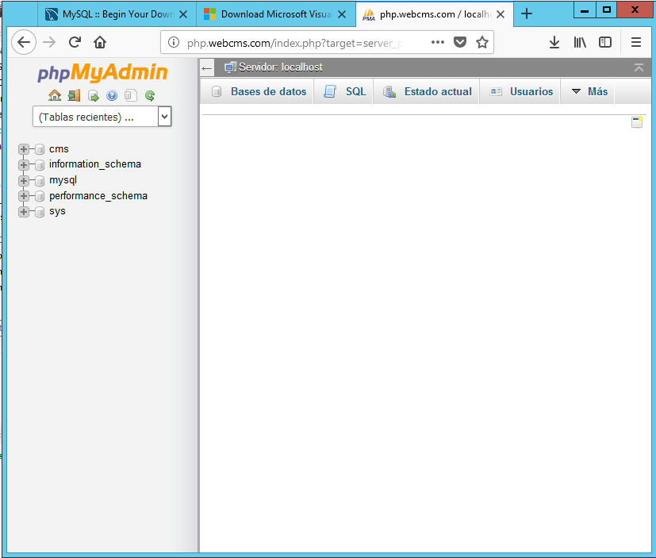
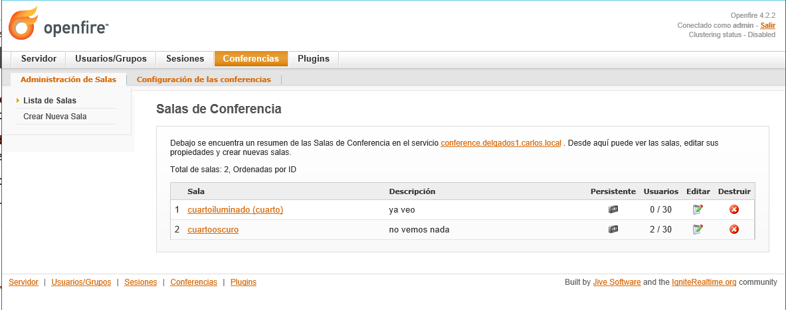

>Práctica Realizada por:
>
>[Carlos Delgado Hernández](https://github.com/carlsjdh)
>
>[Carmelo González Domínguez](https://github.com/SilverGG)
>
>[Víctor García Luis](https://github.com/victorvgl)

# Servidor de Mensajería Instatánea.

---

- Accedemos a nuestra base de datos a través de *phpmyadmin* para agregar una nueva base de datos llamada *openfire*.

- La base de datos *openfire* será usada por `Openfire` para almacenar los datos que crea conveniente.

- Necesitamos ISS para la realización de esta práctica

- Descargamos el sofware `Openfire`

- Realizamos el proceso de configuración

- Conectamos con la base de datos creada anteriormente

- Ahora abriremos la consola de administración para configurar ciertos parametros del servicio

- Accedemos como `admin`

- `Panel de configuración del servidor:`

- Ahora instalamos el cliente de mensajería `Spark`.

- Una vez instalado nos vamos a `avanzado`

- Activamos las casillas de abajo

-  Volvemos a Openfire para agregar usuarios nuevos `User1` y `User2`

- Iniciamos sesión con el usuario `User1` y el dominio de servidor alojado `Openfire`.

- Desde el panel podemos observar la actividad de los usuarios

- Probamos a agregar usuarios entre ellos

- Establecemos chats de conversación perfectamente

- Transferencia de archivo

- Creamos cuartos de conversación para los usuarios

- Finalmente, se crea un chat grupal para todos los usuarios registrados en él.

- Realizamos el mismo proceso pero dentro del servicio `Openfire`

- Probamos a instalar `Sparkweb` en nuestro servidor con un resultado nefasto por problemas con el botón de `login`

