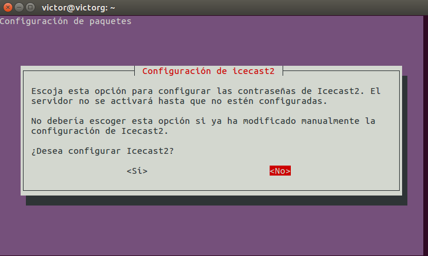

>Práctica Realizada por:
>
>[Carlos Delgado Hernández](https://github.com/carlsjdh)
>
>[Carmelo González Domínguez](https://github.com/SilverGG)
>
>[Víctor García Luis](https://github.com/victorvgl)

# Instalación y Configuración de un Servidor Multimedia Linux


---

### [Instalación y Configuración de un Servidor Multimedia (Audio)](#1)

+ Vamos a instalar un servidor Multimedia ( Audio)  en un servidor linux.

+ Descargaremos y configuraremos todo lo necesario para su correcto funcionamiento.

+ Haremos una serie de comprobaciones desde el mismo servidor y un cliente al igual que accederemos a este desde un navegador y desde un software de reproducción multimedia para comprobar su correcto funcionamiento.

---
#  <a name="1"></a> 1. Servidor Multimedia – Audio

## Instalación y configuración

+ Descargamos e instalamos el paquete **Icecast**


+ Se nos abrirá el asistente de configuración pero como más adelante vamos a configurarlo desde los archivos de configuración le damos a **NO** y dejamos que terminen la instalación.



+ Vamos al archivo de configuración `/etc/icecast2/icecast.xml` y configuramos lo siguiente:

```
<source-password>contraseña_source</source-password>
<admin-user>tu_usuario</admin-user>
<admin-password>contraseña_administrador</admin-password>
```


+ Ahora editaremos el fichero `/etc/default/icecast2` para habilitar el script *init.d* por lo que pondremos la *habilitar en verdadero*.


+ Iniciamos el servicio y comprobamos que está activo.


+ A continuación instalamos el codificador vorbis **ices2**.


+ Creamos un nuevo directorio `mkdir /etc/ices2` y copiamos el archivo de configuración del codificador que está en la ruta ` /usr/share/doc/ices2/examples/ices-playlist.xml` para pasarlo a la ruta anteriormente creada.


+ Editamos el fichero de configuración del codificador y establecemos los parámetros de nuestra emisora mediante las siguientes etiquetas:

```
<name>Mi Estación de Radio</name>
<genre>Pop-Rock</genre>
<description>Radio musical dedicada al pop y al rock</description>

<param name=”file”>/etc/icecast2/playlist.txt</param>

<port>8000</port>
<password>tu_contraseña</password>
<mount>/radiostation</mount>

```


+ Recopilamos unos cuantos ficheros de audio en formato **ogg** creamos el directorio `/tmp/música` y copiamos los mismos dentro de este.


+ Desde el directorio `/etc/icecast2` creamos un **playlist.txt** que va a guardar la lista de reproducción. Le cambiamos los permisos para evitar futuros conflictos.


+ Generamos la lista de reproducción de la siguiente manera y la comprobamos.


+ Antes de ejecutar el codificador, necesitamos crear un directorio para los Logs de ices2. `mkdir /var/log/ices2`


+ Ejecutamos el codificador en background


## Comprobaciones

+ Abrimos un navegador desde el mismo servidor para comprobar su funcionamiento. Entramos desde `localhost:8000` y ponemos nuestro usuario y contraseña anteriormente configurados.


+ Podemos comprobar que accedemos correctamente


+ Ahora vamos a *Mountpoint List* y comprobamos que podemos escuchar la radio en stream correctamente pulsando en **M3U**


+ Abrimos y se escucha perfectamente


+ Podemos ver las stats configuradas anteriormente mientras está en funcionamiento.


+ Comprobamos el estado del servidor en funcionamiento.


## Cliente

+ Ahora comprobamos que efectivamente podemos entrar desde un cliente.


+ Podemos ver, las ips conectadas en tiempo real al servidor, en mi caso, veo la IP del cliente.


+ Por último, vamos a añadir manualmente la dirección de nuestro servidor desde un cliente para comprobar que podemos acceder desde un software de reproducción multimedia.


+ Añadimos la dirección.


+ Buscamos el servidor desde el reproductor.


+ Podemos acceder correctamente.


---
