>Práctica Realizada por:
>
>[Carlos Delgado Hernández](https://github.com/carlsjdh)
>
>[Carmelo González Domínguez](https://github.com/SilverGG)
>
>[Víctor García Luis](https://github.com/victorvgl)

# Instalación y Configuración de un Servidor Multimedia

---

### [Instalación y Configuración de un Servidor Multimedia – Smooth Streaming](#1)

+ Vamos a instalar un servidor Multimedia `ISS Media Services` para el servidor web ISS, para poder dar un servicio en streaming mediante un nuevo sitio web que crearemos con anterioridad. Para ellos también, crearemos un nuevo dominio, en nuestor caso, `midominio.ext` con el alias `bunny` especificado en la práctica que estará asociado a dicho sitio web.

+ Descargaremos emisiones codificadas, cambiaremos su configuración, instalaremos `Silverligh` y haremos comprobaciones.

+ Por último analizaremos los servicios multimedia instalados y su funcionamiento.

### [Instalación y Configuración de un Servidor Multimedia-Codificación de contenido propio](#2)

+ Ahora vamos a seguir utilizando los servicios multimedia pero esta vez, con contenido propio.

+ Vamos a Descargar e instalar Microsoft Expression Encoder junto con la característica de Experiencia de Escritorio en nuestro servidor Windows 2012.

+ Volveremos a crear un sitio web asociado a un registro DNS y a una carpeta física guardada donde queramos. Usaremos un archivo de audio en mp3 como prueba para usar el Encoder.

+ Comprobaremos su funcionamiento.

---
#   1. Servidor Multimedia – Smooth Streaming

## Instalación y configuración

+ Lo primero que tenemos que hacer, es ir al [Enlace Oficial](https://www.microsoft.com/es-es/download/details.aspx?id=27955) de microsoft y descargar el **IIS Media Services**.

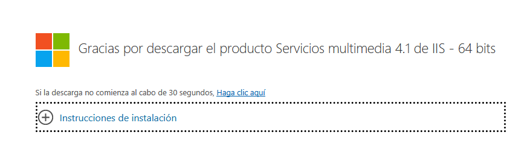

+ Seguimos el asistente de instalación hasta finalizar la misma.

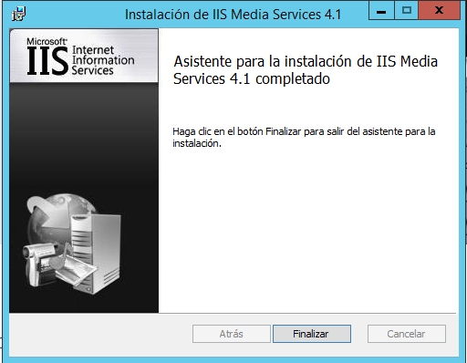

+ Creamos el nuevo registro DNS con el dominio `midominio.ext` y le añadimos un host A con la IP de nuestro servidor y un alias hacia dicho host.

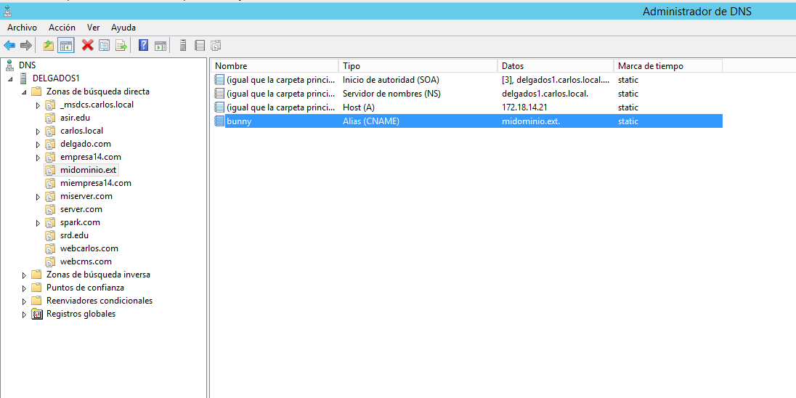

+ Creamos el nuevo Sitio `Bunny` en nuestro servidor ISS y como podemos comprobar desde el administrador del ISS, tenemos los servicios multimedia activos tras la instalación anterior.

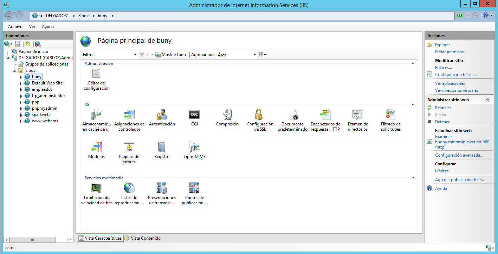

+ Creamos una carpeta en la ruta que queramos para almacenar el ejemplo de emisiones multimedia codificadas que nos descargaremos desde el servidor del aula. Descomprimimos y el archivo SmoothStreamingPlayer.html lo renombraremos como index.html para que nuestro sitio lo reconozca como página principal.

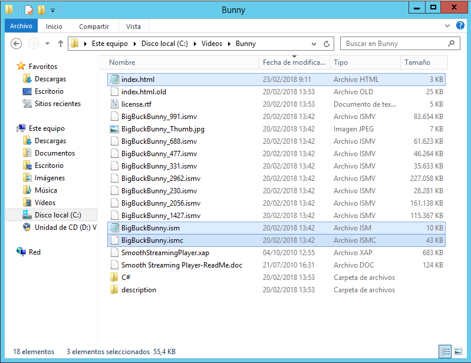

+ Enlazamos el sitio a la carpeta anteriormente creada.

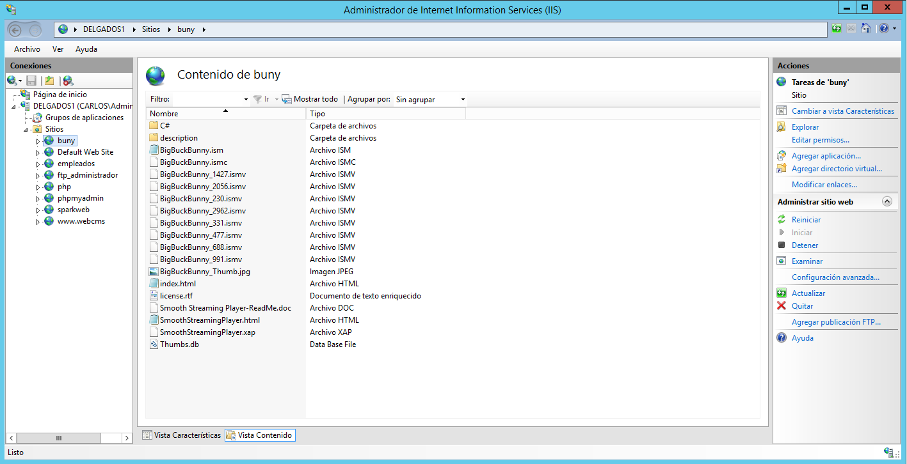

+ Modificamos la url del archivo anteriormente renombrado con la dirección de nuestro dominio.

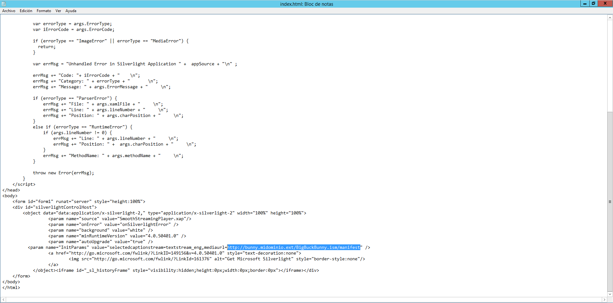

## Instalación de Silverlight y comprobación.

+ Abrimos un navegador con la dirección `bunny.midominio.ext` e instalamos el Silverlight.

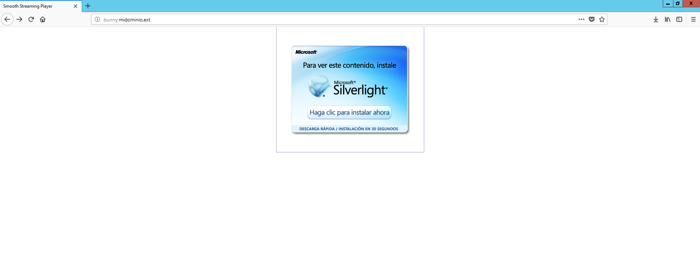

+ Seguimos los pasos de instalación.

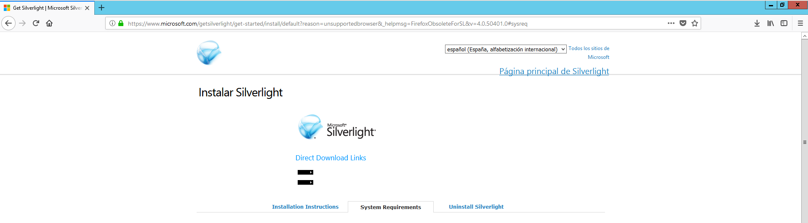

+ Recargamos la página y como podemos comprobar, funciona correctamente. Hacemos la comprobación desde un cliente y también funciona correctamente.

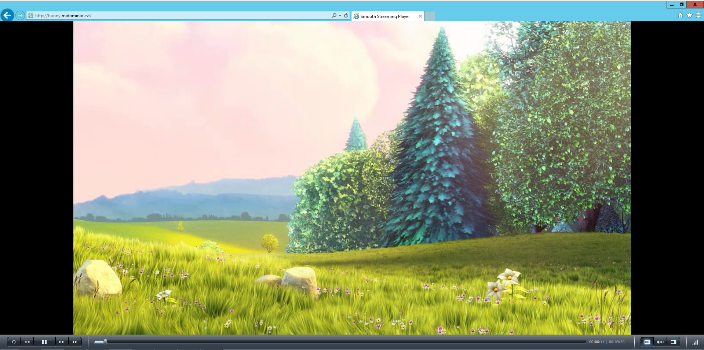

## Limitación de velocidad

+ En los ajustes del ISS de nuestro sitio, podemos limitar la velocidad de transmisión, opción muy importante para poder albergar a un mayor número de usuarios simultáneos.

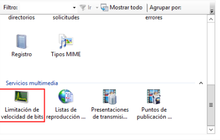

+ Entramos y como podemos comprobar, no tenemos ninguna limitación a ninguna extensión de archivos multimedia.

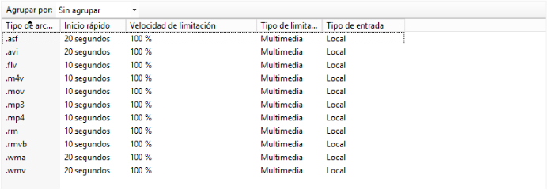

+ Vamos a limitar por ejemplo, los archivos multimedia de tipo mp4. Para ello, le damos `botón derecho/Modificar`

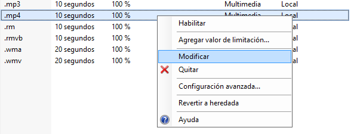

+ Le cambiamos el valor de limitación al que queramos.

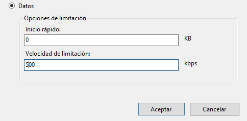

+ Y ya solo nos queda habilitar la opción que por defecto viene sin limitación.

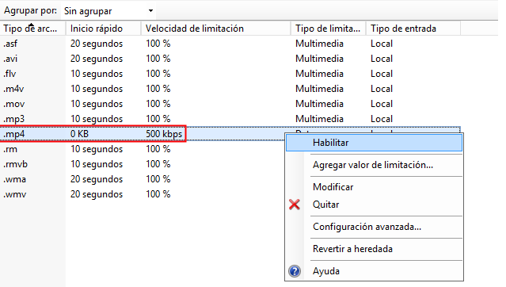

## Smooth Streaming

+ Ahora vamos a ver otra característica de transmisión por secuencia suave que nos permite añadir nuevas emisiones multimedia y modificar la que ya tenemos, como quitarle una pista de audio, añadir otra, etc.

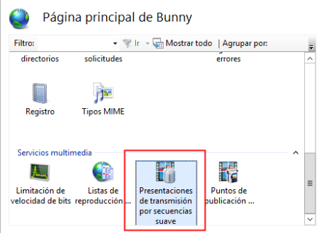

+ Vamos al apartado `Modificar transmisión por secuencias suave`

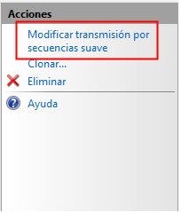

+ Aquí podremos ver las emisiones multimedia, modificarla, añadir y quitar pistas, etc..

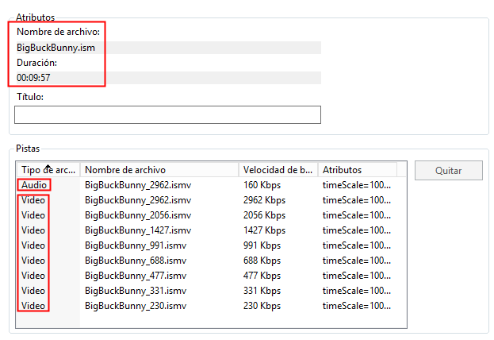

#   1. Servidor Multimedia – Codificación de contenido propio

## Instalación y configuración.

+ Vamos al asistente para agregar roles y características y agregamos **Experiencia de escritorio**

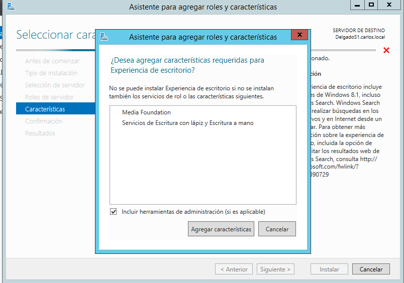

+ Seguimos el proceso de instalación hasta finalizar.

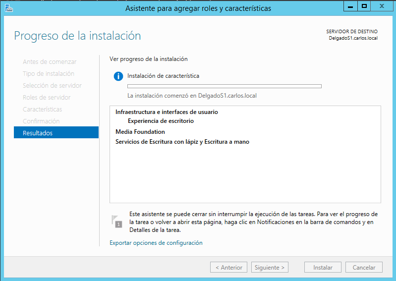

+ Vamos al [Enlace](https://www.microsoft.com/es-es/download/details.aspx?id=27870) para descargar el Microsoft Expressión Encoder.

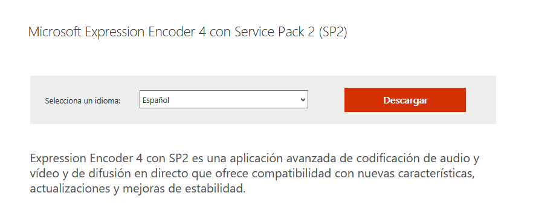

+ Hacemos la instalación después de descargarlo.

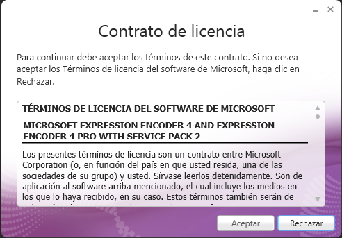
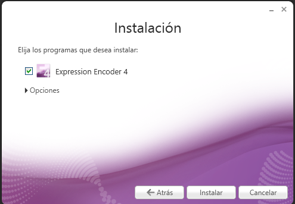

+ Creamos el nuevo registro DNS `tudominio.ex` con un host tipo A con la IP de nuestro servidor y un alias `playlist` apuntando al host.

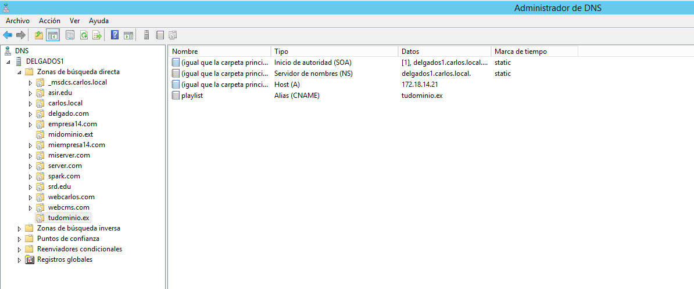

+ Creamos el nuevo sitio web `Playlist` y lo asociamos a la ruta con la carpeta que hemos creado en C: llamada **playlist**.

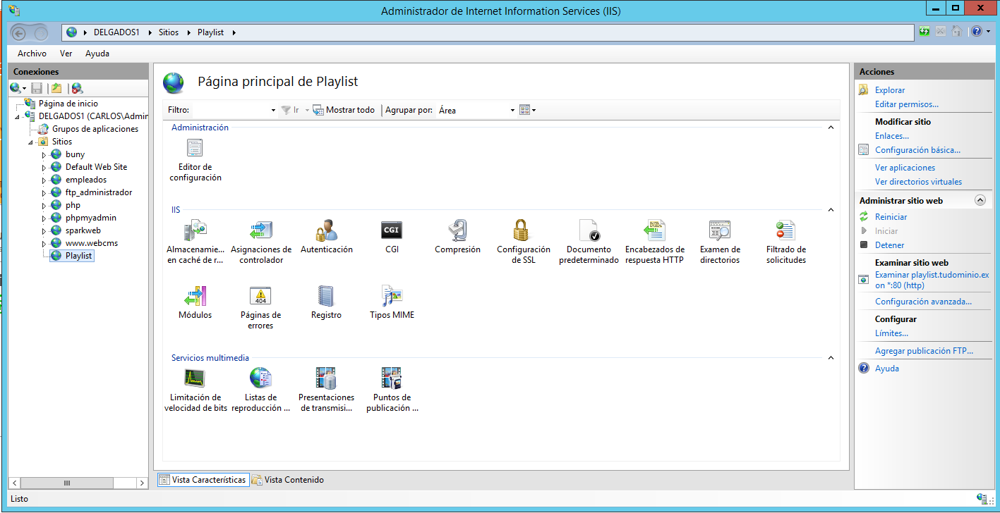

## Expression encoder

+ Abrimos el Expression encoder y abrimos un Proyecto de Silverlight.

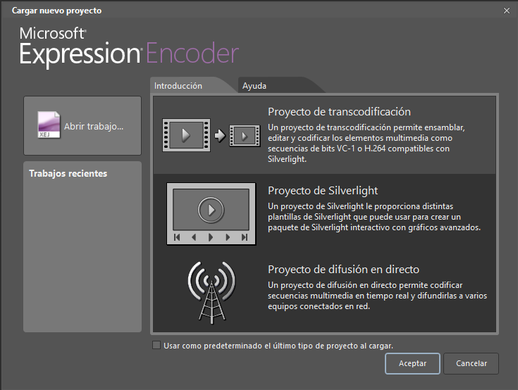

+ Añadimos los elementos multimedia que queremos codificar ( en neustro caso es un archivo en mp3) y le especificamos la ruta creada anteriormente.

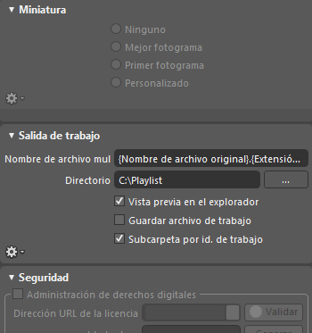

+ Al acabar la codificación podemos comprobar que en la ruta C:/playlist vemos que se han generado los archivos codificados.

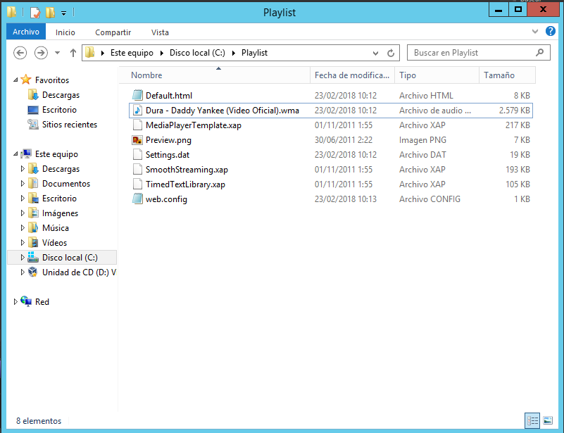

+ Ahora debemos añadir Default.html a los documentos predeterminados o renombrar el archivo para poder acceder directamente a nuestro sitio `playlisit.tudominio.ex`

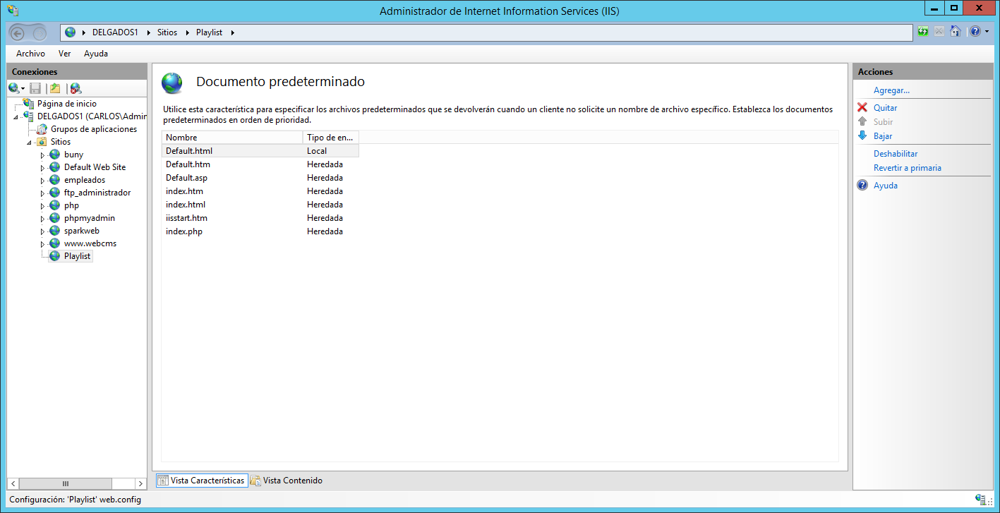

## Comprobación

+ Como podemos comprobar funciona correctamente tanto desde el servidor como el cliente.

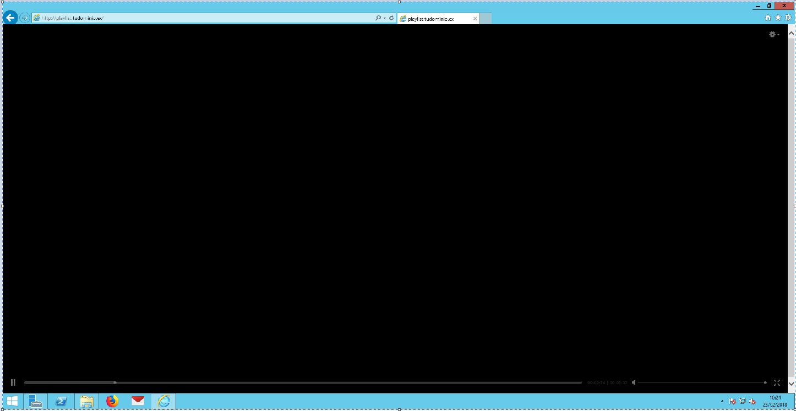

---
