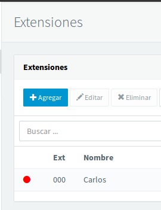
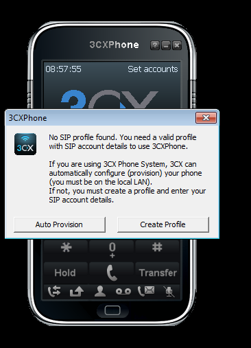

>Práctica Realizada por:
>
>[Carlos Delgado Hernández](https://github.com/carlsjdh)
>
>[Carmelo González Domínguez](https://github.com/SilverGG)
>
>[Víctor García Luis](https://github.com/victorvgl)

# Instalación y Configuración de un Servidor de VOIP sobre Ubuntu.

---

### [Instalación y Configuración de un Servidor VOIP](#1)

+ Instalación de la distribución `Elastix` basada en Debian.
+ Configuración del servidor `Elastix`.
+ Configuración del software cliente.
+ Pruebas de conectividad.

---
#   1. Servidor VOIP

## Instalación y configuración

+ Descargamos la imagen `iso` de la página web [Elastix](https://www.elastix.org/es/downloads/).

+ Creamos una `máquina virtual` para instalar la distribución anteriormente descargada.

+ Establecemos los parámetros de configuración generales:

+ Una vez terminado el proceso de instalación, la máquina se iniciará.

+ Seleccionamos `(1) Using a Web Browser` y nos mostrará la IP del servidor para acceder a través de la wb.

+ Una vez dentro, configuramos el servidor para funcionar como `Servidor Voip`.

+ El servicio necesita de una licencia. Nos registraremos en la página web [3CX](https://www.3cx.com/).

+ Nos mandan la clave de licencia al correo asociado al registro de la cuenta. Es una clave para ofrecernos un servicio de prueba.

+ Registramos un usuario para la consola de nuestro servidor Voip.

+ Asignamos una IP estática, en este caso, el servidor `Elastix`.

+ Seguiremos rellenando datos para la configuración del servicio

+ Establecemos la longitud del número de extensión de llamada `3 Digits`.

+ Registro de los datos del usuario asociado a la licencia `3cx`.

+ Ya tenemos todo listo para arrancar el servicio.

+ Si accedemos a la IP del servidor, nos muestra el panel de inicio de sesión.

+ Iniciamos el servicio con el usuario y contraseña previamente especificados.

+ Y esto sería el panel de control principal que nos encontraríamos al conectarnos a Elastix.

+ Ahora descargamos el cliente de `Voip` para establecer las llamadas. El software necesario se llama `Softphone` disponible para Windows.

+ Podemos ver los usuarios registrados para realizar llamadas. Por defecto sale el usuario registrado al servicio.

+ Agregamos un número de teléfono en el apartado de extensiones del panel de control de `Elastix`.

+ Iniciamos el `software cliente`

+ Agregamos el usuario `Pepe` creado anteriormente.

+ Ahora tenemos el programa configurado para el usuario `Pepe`.

+ En el servidor podemos observar como nos muestra si está conectado el usuario

+ Ahora creamos otro usuario `María` para realizar las pruebas de llamadas entre distintos clientes.

+ Procedemos a marcar el número asociado al usuario `Pepe` desde el usuario `Maria`. El programa cliente de `Pepe` nos muestra esto:

+ El usuario `Pepe` contesta a la llamada y se establece la conexión `Voip`.

